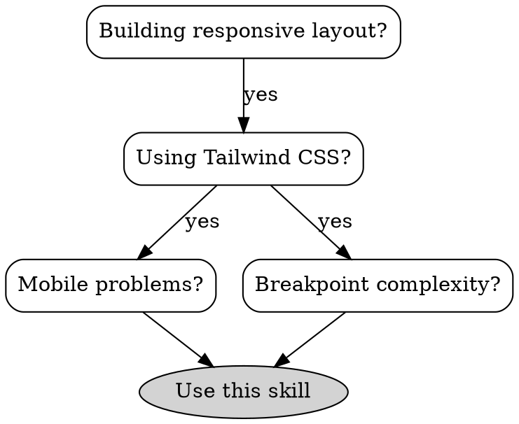

# Tailwind Responsive Design

Implement mobile-first, maintainable responsive layouts using Tailwind CSS's breakpoint system and utilities.

## When to Use



**Use when:**

- Implementing new responsive layouts with Tailwind
- Fixing mobile/tablet layout issues
- Refactoring breakpoint-heavy components
- Creating responsive component variants
- Optimizing breakpoint utility usage
- Implementing container queries for components

**NOT for:**

- Custom CSS media queries (use Tailwind's `@screen` directive instead)
- JavaScript-based responsive behavior (use CSS breakpoints)
- Non-Tailwind projects (see responsive-design skill)

## Core Principle

**Mobile-first, strategic breakpoints, component-level responsiveness.**

Tailwind's breakpoint system is mobile-first: unprefixed utilities apply to all screens, prefixed utilities apply from that breakpoint upward.

```html
<!-- Mobile-first: Start with mobile, add enhancements -->
<div class="w-full md:w-1/2 lg:w-1/3">
  Mobile: full width, Tablet+: half, Desktop+: third
</div>
```

## Quick Reference

### Default Breakpoints

| Prefix | Min Width | Target Devices                  |
| ------ | --------- | ------------------------------- |
| (none) | 0px       | Mobile first (base styles)      |
| `sm:`  | 640px     | Landscape phones, small tablets |
| `md:`  | 768px     | Tablets portrait                |
| `lg:`  | 1024px    | Laptops, small desktops         |
| `xl:`  | 1280px    | Desktops                        |
| `2xl:` | 1536px    | Large desktops                  |

### Responsive Utility Pattern

```html
<!-- Pattern: base → sm → md → lg -->
<div
  class="
  text-sm           <!-- Base: mobile -->
  md:text-base      <!-- Tablet+ -->
  lg:text-lg        <!-- Desktop+ -->
"
>
  Responsive text
</div>
```

### Common Responsive Patterns

| Pattern   | Mobile        | Tablet           | Desktop          |
| --------- | ------------- | ---------------- | ---------------- |
| Columns   | `grid-cols-1` | `md:grid-cols-2` | `lg:grid-cols-3` |
| Layout    | `flex-col`    | `md:flex-row`    | (inherited)      |
| Padding   | `p-4`         | `md:p-6`         | `lg:p-8`         |
| Text      | `text-base`   | `md:text-lg`     | (inherited)      |
| Show/Hide | `block`       | `md:block`       | `lg:hidden`      |

## Core Patterns

### Pattern 1: Mobile-First Grid

```html
<!-- GOOD: Mobile-first grid -->
<div class="grid grid-cols-1 md:grid-cols-2 lg:grid-cols-4 gap-4">
  <div>Item 1</div>
  <div>Item 2</div>
  <div>Item 3</div>
  <div>Item 4</div>
</div>

<!-- BAD: Desktop-first -->
<div class="grid grid-cols-4 sm:grid-cols-2">
  <!-- Requires more overrides, harder to maintain -->
</div>
```

### Pattern 2: Responsive Flex Direction

```html
<!-- Stack on mobile, side-by-side on tablet+ -->
<div class="flex flex-col md:flex-row gap-4">
  <div class="flex-1">Content 1</div>
  <div class="flex-1">Content 2</div>
</div>
```

### Pattern 3: Responsive Spacing

```html
<!-- Scale padding across breakpoints -->
<section class="px-4 sm:px-6 md:px-8 lg:px-12 py-8 md:py-12 lg:py-16">
  <!-- Content with responsive padding -->
</section>

<!-- Scale gaps between children -->
<div class="space-y-4 md:space-y-6 lg:space-y-8">
  <div>Item 1</div>
  <div>Item 2</div>
</div>
```

### Pattern 4: Show/Hide by Breakpoint

```html
<!-- Mobile menu button: visible mobile only -->
<button class="md:hidden p-2">
  <svg><!-- Menu icon --></svg>
</button>

<!-- Desktop nav: hidden on mobile -->
<nav class="hidden md:flex space-x-6">
  <a href="#">Home</a>
  <a href="#">About</a>
</nav>

<!-- Show only on specific range -->
<div class="hidden lg:block xl:hidden">Only visible between lg and xl</div>
```

### Pattern 5: Container Queries (v3.4+)

Use container queries for component-level responsiveness:

```javascript
// tailwind.config.js
module.exports = {
  plugins: [require("@tailwindcss/container-queries")],
};
```

```html
<!-- Define container context -->
<div class="@container">
  <!-- Component responds to container, not viewport -->
  <article
    class="
    flex flex-col
    @md:flex-row
    @md:gap-4
  "
  >
    
    <div class="p-4 @md:p-0">
      <h2 class="text-lg @md:text-xl @lg:text-2xl">Title</h2>
    </div>
  </article>
</div>
```

**When to use container queries:**

- Reusable components (cards, widgets)
- Components used in different contexts (sidebar vs main)
- Nested responsive layouts
- Dashboard widgets

### Pattern 6: Responsive Typography

```html
<!-- Scale headings across breakpoints -->
<h1 class="text-2xl sm:text-3xl md:text-4xl lg:text-5xl font-bold">
  Responsive Heading
</h1>

<!-- Body text with line height -->
<p class="text-sm sm:text-base md:text-lg leading-relaxed">
  Body text that scales appropriately
</p>

<!-- Max-width for readability -->
<p class="text-base max-w-prose mx-auto">
  Text that stays readable at all sizes
</p>
```

### Pattern 7: Responsive Images

```html
<!-- Responsive width, fixed aspect ratio -->


<!-- Responsive max-width -->


<!-- Container for aspect ratio -->
<div class="aspect-square sm:aspect-video w-full overflow-hidden">
  
</div>
```

## Anti-Patterns

### ❌ Breakpoint Explosion

```html
<!-- BAD: Too many breakpoint variants -->
<div class="text-xs sm:text-sm md:text-base lg:text-lg xl:text-xl 2xl:text-2xl">
  Unnecessary complexity
</div>

<!-- GOOD: Strategic breakpoints (2-3 max) -->
<div class="text-sm md:text-base lg:text-lg">Clear, maintainable</div>
```

**Rule:** Use 2-3 breakpoints per property. More indicates over-optimization.

### ❌ Desktop-First Thinking

```html
<!-- BAD: Desktop-first requires mobile overrides -->
<div class="grid grid-cols-4 sm:grid-cols-3 md:grid-cols-2">
  <!-- Hard to reason about mobile -->
</div>

<!-- GOOD: Mobile-first -->
<div class="grid grid-cols-1 sm:grid-cols-2 md:grid-cols-4">
  <!-- Clear mobile foundation -->
</div>
```

### ❌ Arbitrary Breakpoint Overload

```html
<!-- BAD: Arbitrary values everywhere -->
<div class="min-[823px]:flex max-[1043px]:grid">
  <!-- GOOD: Use standard breakpoints -->
  <div class="md:flex lg:grid">
    <!-- Custom breakpoints belong in config, not markup -->
  </div>
</div>
```

### ❌ Forgotten Mobile Styles

```html
<!-- BAD: No base styles, assumes desktop -->
<div class="md:grid-cols-3 lg:grid-cols-4">
  <!-- Breaks on mobile -->
</div>

<!-- GOOD: Always define mobile base -->
<div class="grid grid-cols-1 md:grid-cols-3 lg:grid-cols-4">
  <!-- Works everywhere -->
</div>
```

### ❌ Using Only Viewport Breakpoints for Components

```html
<!-- BAD: Component relies on viewport for layout -->
<div class="flex flex-col lg:flex-row">
  <!-- Breaks when used in narrow container -->
</div>

<!-- GOOD: Container queries for reusable components -->
<div class="@container">
  <div class="flex flex-col @lg:flex-row">
    <!-- Adapts to container width -->
  </div>
</div>
```

## Real-World Example: Responsive Card

```html
<div class="@container">
  <article
    class="
    bg-white rounded-lg overflow-hidden shadow-md
    flex flex-col
    @md:flex-row
    @md:gap-4
  "
  >
    <!-- Image -->
    

    <!-- Content -->
    <div class="p-4 sm:p-5 @md:p-0 @md:py-4 flex flex-col flex-1">
      <h2
        class="
        text-lg sm:text-xl
        @md:text-xl @lg:text-2xl
        font-semibold
        mb-2
      "
      >
        Card Title
      </h2>

      <p
        class="
        text-sm sm:text-base
        text-gray-600
        @md:line-clamp-3
        mb-4 @md:mb-0
      "
      >
        Description that adapts to available space
      </p>

      <a
        href="#"
        class="
        mt-auto
        inline-flex items-center
        text-blue-600 hover:text-blue-700
        font-medium
      "
      >
        Learn more
      </a>
    </div>
  </article>
</div>
```

## Best Practices

1. **Always start with mobile styles** - Unprefixed utilities = mobile base
2. **Use 2-3 breakpoints per property** - More is usually over-optimization
3. **Standard breakpoints > arbitrary** - Customize in `tailwind.config.js` if needed
4. **Container queries for components** - Viewport queries for page layouts
5. **Test on real devices** - Browser dev tools don't catch all mobile issues
6. **Touch targets ≥ 44×44px** - Critical for mobile usability
7. **Use `max-w-*` for content** - Prevents overly wide text on large screens
8. **Dynamic viewport units** - Use `dvh` instead of `vh` for mobile browsers

## Configuration

### Custom Breakpoints

```javascript
// tailwind.config.js
module.exports = {
  theme: {
    screens: {
      // Add to defaults (don't replace)
      xs: "475px",
      "3xl": "1920px",

      // Range-only breakpoints
      "tablet-only": { min: "640px", max: "1023px" },

      // Max-width breakpoints (use sparingly)
      "max-md": { max: "767px" },

      // Orientation-based
      tall: { raw: "(min-height: 800px)" },
    },
  },
};
```

### Extending Spacing Scale

```javascript
// tailwind.config.js
module.exports = {
  theme: {
    extend: {
      spacing: {
        128: "32rem",
        144: "36rem",
      },
    },
  },
};
```

## Common Issues

| Issue                    | Cause                          | Solution                                          |
| ------------------------ | ------------------------------ | ------------------------------------------------- |
| Horizontal scroll        | Fixed widths, `w-full` missing | Add `w-full` or `max-w-full` to images/containers |
| Text too small on mobile | Large desktop base only        | Start with `text-base` or larger unprefixed       |
| Touch targets too small  | Desktop-sized buttons          | Use `min-h-[44px]` on mobile interactive elements |
| 100vh issues on mobile   | Browser UI overlap             | Use `min-h-dvh` or `h-dvh` instead of `vh`        |
| Images stretching        | Missing aspect ratio           | Add `aspect-*` class or use `h-auto`              |
| Layout breaks mid-range  | Too few breakpoints            | Add intermediate breakpoint (`md:` or `lg:`)      |

## Related Skills

- **responsive-design**: Container queries, fluid typography, CSS Grid
- **tailwind-utility-classes**: Effective utility class usage
- **tailwind-components**: Reusable component patterns

## References

This skill is based on and extends the following reference materials:

- **[@references/responsive-design.md](../references/responsive-design.md)** - Modern responsive design techniques including container queries, fluid typography, CSS Grid patterns, and mobile-first breakpoint strategies
- **[@references/responsive-web-design.md](../references/responsive-web-design.md)** - Mobile-first responsive layouts using Flexbox, Grid, and media queries for cross-device compatibility
- **[@references/tailwind-responsive-design.md](../references/tailwind-responsive-design.md)** - Tailwind CSS breakpoint system, responsive utilities, and container query patterns

## Resources

- [Tailwind Responsive Design Documentation](https://tailwindcss.com/docs/responsive-design)
- [Tailwind Container Queries](https://tailwindcss.com/docs/container-queries)
- [Mobile-First Responsive Web Design](https://www.lukew.com/ff/entry.asp?933)
