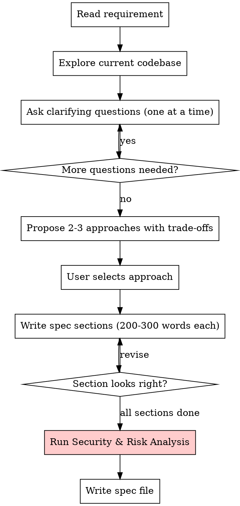
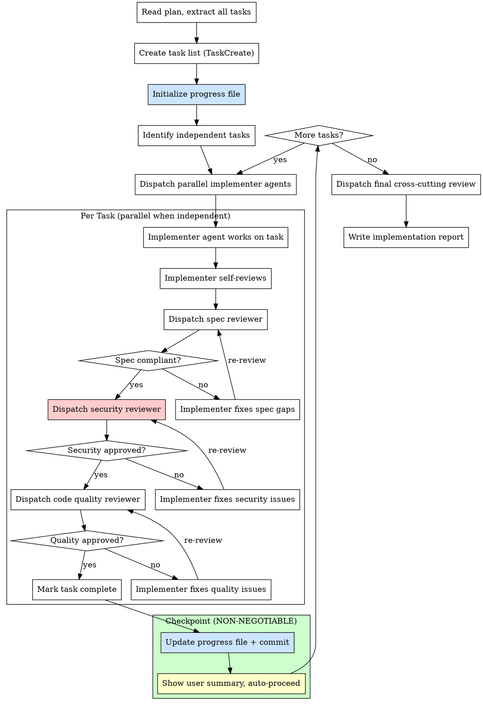
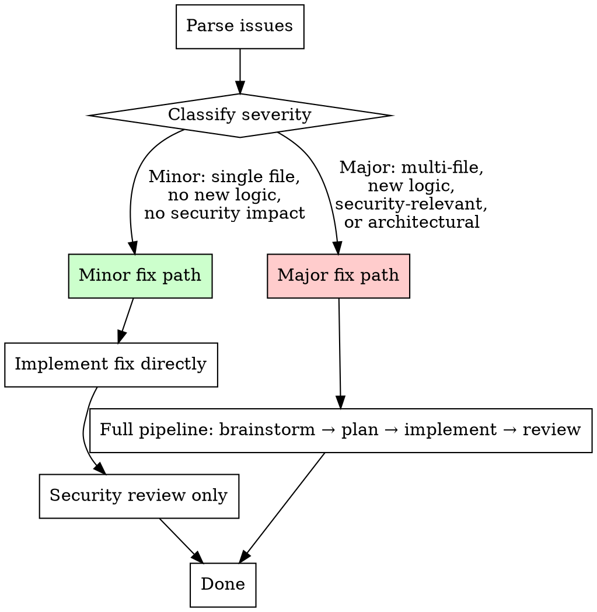

# Secure Feature Pipeline

## Overview

End-to-end feature delivery pipeline for the Intelligent Inventory Dashboard. Takes a feature from raw requirement through brainstorming, planning, implementation, review, and hotfix — with security, risk assessment, and data integrity checks woven into every step.

**Core principle:** Inventory management applications require defense-in-depth. Every step produces artifacts that feed the next step, and every step includes a dedicated security and risk assessment section.

**Announce at start:** "I'm using the secure-feature-pipeline skill — step: `{step}`."

## Priority Rule #1: Error Handling and Retries

**BEFORE retrying any failed command:**

1. **Investigate Root Cause First** — Read the error, identify WHY it failed
2. **DON'T Retry Immediately** — Same error will recur
3. **Retry Limit** — Max 5 retries, then ask user

## Command Steps

This skill is invoked with one of 5 command steps. The user passes the required input for each step.

| Step | Command | Input | Output |
|------|---------|-------|--------|
| 1 | `brainstorm` | Feature requirement (text) | Spec file (`docs/specs/YYYY-MM-DD-<feature>-spec.md`) |
| 2 | `plan` | Spec file path | Plan file (`docs/plans/YYYY-MM-DD-<feature>-plan.md`) |
| 3 | `implement` | Plan file path | Implementation report (`docs/reports/YYYY-MM-DD-<feature>-report.md`) |
| 4 | `review` | Implementation report path | Review verdict (approve / issues found) |
| 5 | `fix` | Issue description OR report with issues | Loops back to step 1 (brainstorm the fix) |

---

## Step 1: Brainstorm

**Input:** Feature requirement text from user.

**Goal:** Deeply understand the feature, find risks/issues/security concerns, and produce a precise spec file that serves as the contract for planning.

**This is the most important step.** Take your time. Be thorough. A bad spec cascades into bad planning and bad code.

### Process



### Codebase Exploration (REQUIRED)

Before asking any questions, explore the codebase to understand:

1. **Existing patterns** — How similar features are already implemented
2. **Affected files** — Which handlers, services, repositories, components will be touched
3. **Data flow** — How data moves through OpenAPI → oapi-codegen → backend → frontend types
4. **Current security measures** — Middleware, validation, authorization checks
5. **Database schema** — Existing tables (dealerships, vehicles, vehicle_actions), relationships, constraints

Use parallel exploration agents to read:
- `api/openapi.yaml` — API specification (single source of truth)
- Related backend services and handlers in `backend/internal/`
- Related frontend pages and components in `frontend/src/`
- Existing tests for the affected area

### Question Guidelines

- **One question at a time** — Don't overwhelm
- **Multiple choice preferred** — When possible
- **Security-focused questions** — Always ask about:
  - Who should have access? (authorization)
  - What data is sensitive? (data classification)
  - What happens if this fails? (failure modes)
  - What are the abuse scenarios? (threat modeling)

### Security & Risk Analysis (MANDATORY)

Before writing the spec, complete this analysis using the checklist in `./security-checklist.md`. The analysis MUST cover:

1. **Data Flow Diagram (DFD)** — Map every data flow through trust boundaries (REQUIRED FIRST)
2. **STRIDE per trust boundary** — Apply STRIDE to each boundary crossing identified in the DFD
3. **OWASP Top 10 relevance** — Which vulnerabilities apply?
4. **Data integrity** — Can vehicle data or aging stock calculations be manipulated?
5. **Authorization gaps** — Can one dealership access another's data?
6. **Input validation** — What needs server-side validation?
7. **Rate limiting** — Can this be abused at scale?
8. **Data exposure** — What sensitive data could leak?
9. **Audit trail** — What operations need logging? (vehicle_actions is append-only)
10. **External dependency risks** — What third-party APIs/packages are involved? What if they fail or are compromised?

**DFD is not optional.** STRIDE without data flows is ad-hoc and misses boundary-crossing threats. See `./security-checklist.md` for the DFD template.

### C4 Architecture Diagrams (REQUIRED)

**REQUIRED SUB-SKILL:** Use the `c4-architecture` skill for Mermaid C4 diagram syntax, element types, relationship labeling, and best practices. Follow the conventions in that skill when creating or updating any C4 diagram.

Before writing the spec, determine which C4 diagrams need to be **created or updated** for this feature. The project maintains architecture documentation in `docs/plans/` using **Mermaid syntax**.

**Reference diagram:** `docs/plans/2026-03-17-system-design.md` — Contains C4 Container diagram, high-level architecture, and project structure.

**For each feature, assess:**

| Diagram Level | When to Update | When to Create New |
|---------------|---------------|-------------------|
| L1 Context | New external system integration | Never (rarely changes) |
| L2 Container | New runtime unit (worker, scheduler) | Never (rarely changes) |
| L3 Backend | New handler, service, or repository | Update system design doc |
| L3 Frontend | New page, feature module, or shared component | Update system design doc |
| L4 Code | Complex domain with 3+ models/services | New section in system design doc |

**Include in the spec:**
1. Which sections of the system design doc need updates (with description of changes)
2. Whether a new L4 code diagram is needed
3. Draft the Mermaid diagrams for new diagrams

**Mermaid format conventions** (match existing diagrams):
- Use `C4Container` / `C4Component` for architecture diagrams
- Use `classDiagram` with `direction TB` for L4 code diagrams
- Include `<<interface>>` annotations for service/repository interfaces
- Show dependencies between components with labeled arrows

### Runtime Flow Diagrams (REQUIRED)

After implementation is complete, determine which **runtime flow diagrams** need to be created or updated. C4 diagrams show static structure ("what exists"); flow diagrams show dynamic behavior ("what happens when").

**For each feature, assess:**

| Condition | Action |
|-----------|--------|
| New API endpoint with multi-step business logic | Add sequence diagram to system design doc or a new `docs/plans/flow-*.md` file |
| New background job or scheduled task | Add to a cross-cutting flow document |
| New branching/decision logic (e.g., aging stock actions) | Add flowchart |
| Existing flow changed (new steps, different error paths) | Update the existing diagram |
| Simple CRUD with no branching or multi-service coordination | No flow diagram needed |

**Include in the spec:**
1. Which existing flow diagrams need updates (with description of changes)
2. Whether new flow diagrams are needed
3. Brief description of the flow to be diagrammed

**Flow diagram conventions:**
- `sequenceDiagram` for multi-participant request-response flows (most common)
- `flowchart TD` for branching/decision logic
- `stateDiagram-v2` for lifecycle/state-machine flows
- Each diagram includes: trigger, endpoint, source file reference
- Include error/alternative paths with `alt`/`else` blocks, not just happy path
- Add "Key Invariants" and "Error Paths" table after each diagram

### Spec File Structure

Save to: `docs/specs/YYYY-MM-DD-<feature>-spec.md`

```markdown
# [Feature Name] Specification

## Summary
[One paragraph describing what this feature does and why]

## User Stories
- As a [role], I want [action], so that [benefit]

## Functional Requirements
### FR-1: [Requirement Name]
[Detailed description]
**Acceptance criteria:**
- [ ] ...

## Non-Functional Requirements
- Performance: [expectations]
- Security: [requirements]

## Architecture Changes (C4)
### Diagrams to Update
[Which existing C4 diagrams need changes and what changes]

### New Diagrams
[L4 code diagram if this is a complex domain — include Mermaid source]

## Runtime Flow Diagrams
### Flow Diagrams to Update
[Which existing flow diagrams need changes and what changes]

### New Flow Diagrams
[New flows to document — specify target file, diagram type, and brief flow description]

## Data Model Changes
[New/modified tables, fields, relationships — referencing dealerships, vehicles, vehicle_actions]

## API Changes
[New/modified endpoints with request/response shapes — must be added to api/openapi.yaml first]

## UI/UX Changes
[New/modified pages, components, flows]

**REQUIRED for any frontend/UI work:**
- Follow **mobile-first design** — use `responsive-design` skill for Tailwind breakpoints and layout
- Follow **ui-ux-pro-max** skill for design system, color palette, typography, accessibility, and component patterns
- Follow **react-best-practices** skill for performance (no waterfalls, direct imports, dynamic imports for heavy components)
- Components use **shadcn/ui** primitives — check existing components before creating new ones

### Existing Component Inventory (REQUIRED)
Before proposing new components, check what already exists and can be reused:

| Need | Existing Component | Location |
|------|--------------------|----------|
| [describe need] | [component name or "NEW — create in components/"] | [path] |

**Component library:** shadcn/ui primitives in `frontend/src/components/ui/`, composed into feature components in `frontend/src/components/`.

### New Components (if any)
| Component | Location | Justification (why not reuse existing) |
|-----------|----------|----------------------------------------|
| [name] | `frontend/src/components/` | [reason] |

## Security & Risk Assessment

### Data Flow Diagram
| # | Source | Data | Trust Boundary Crossed? | Destination | Notes |
|---|--------|------|------------------------|-------------|-------|
| 1 | ... | ... | Yes/No: [boundary] | ... | ... |

### Trust Boundaries
| Boundary | Crossed By | Security Control |
|----------|-----------|-----------------|
| Internet → App | User requests | Validation + middleware |

### Threats Identified (STRIDE per boundary crossing)
| # | Data Flow | Boundary | STRIDE | Threat | Severity | Mitigation |
|---|-----------|----------|--------|--------|----------|------------|
| T-1 | 1 | Internet → App | Tampering | ... | High/Medium/Low | ... |

### Authorization Rules
[Who can do what — dealership-scoped access]

### Input Validation Rules
[What needs validation, where]

### External Dependency Risks
[Third-party APIs/packages, failure modes, trust level]

### Sensitive Data Handling
[What data is sensitive, how to protect it]

### Issues & Risks Summary
1. [Issue/risk a]
2. [Issue/risk b]
3. [Issue/risk c]

## Edge Cases & Error Handling
[What can go wrong, how to handle it]

## Dependencies & Assumptions
[External services, existing features, assumptions]

## Out of Scope
[What this feature explicitly does NOT include]
```

---

## Step 2: Plan

**Input:** Spec file path from brainstorm step.

**Goal:** Create a detailed, bite-sized implementation plan with exact file paths, code, commands, and security considerations per task.

### Process

1. **Read the spec file completely**
2. **Explore codebase** — Identify exact files to create/modify
3. **Break into tasks** — Each task is 2-5 minutes of work
4. **Order tasks** — Dependencies first, then parallel-safe tasks
5. **Write security notes per task** — What validation, authorization, or sanitization is needed
6. **Include C4 diagram updates** — Add a task for updating/creating architecture diagrams per the spec
7. **Include runtime flow diagram updates** — Add a task for creating/updating flow diagrams per the spec
8. **Write the plan file**

### Plan File Structure

Save to: `docs/plans/YYYY-MM-DD-<feature>-plan.md`

```markdown
# [Feature Name] Implementation Plan

> **For implementation:** Use the secure-feature-pipeline skill, step: implement

**Goal:** [One sentence]
**Spec:** [Path to spec file]
**Architecture:** [2-3 sentences]
**Tech Stack:** Go + Chi + oapi-codegen + pgx | Next.js 14 + TanStack Query + shadcn/ui | PostgreSQL 16

## Security Implementation Notes
[Cross-cutting security concerns for the entire feature]
- Authentication: [how auth is handled]
- Authorization: [dealership-scoped resource ownership checks]
- Input validation: [server-side validation strategy]
- Data sanitization: [XSS, injection prevention]

## C4 Architecture Diagram Updates
[Which diagrams to update/create, referencing spec's Architecture Changes section]

---

### Task 0: Update C4 Architecture Diagrams

**Files:**
- Modify: `docs/plans/2026-03-17-system-design.md` (if architecture changes)

**Steps:**
1. Update existing Mermaid diagrams with new components
2. Create L4 code diagram if needed (classDiagram with interfaces)
3. Commit diagram changes

---

### Task N-1: Create/Update Runtime Flow Diagrams

**Files:**
- Modify: existing flow diagram file (if updating flows)
- Create: `docs/plans/flow-<domain>.md` (if new domain)

**Steps:**
1. Read the implemented service code to trace the actual runtime flow
2. Identify diagram type: `sequenceDiagram` for multi-participant flows, `flowchart TD` for branching logic, `stateDiagram-v2` for lifecycle flows
3. Write diagram with: trigger, endpoint, source file reference, error/alternative paths
4. Add "Key Invariants" section listing business rules maintained during the flow
5. Add "Error Paths" table (Condition | Response | Rollback)
6. Commit diagram changes

**When to skip:** Simple CRUD with no branching, no multi-service coordination, and no complex error handling.

---

### Task 1: [Component Name]

**Files:**
- Create: `exact/path/to/file`
- Modify: `exact/path/to/existing:line-range`
- Test: `exact/path/to/test`

**Security notes:** [Task-specific security concerns]

**Step 1: Write the failing test**
[Exact test code — test MUST be written BEFORE implementation]

**Step 2: Run test to verify it fails**
[Exact command with expected failure output]

**Step 3: Write minimal implementation**
[Exact implementation code to make the test pass]

**Step 4: Run test to verify it passes**
[Exact command with expected pass output]

**Step 5: [Additional steps if needed — validation, auth checks, etc.]**
[Exact code]

**Step N: Commit**
```

### Frontend Task Template (For UI Tasks)

For tasks involving frontend/UI work, include these additional steps:

```markdown
### Task N: [Frontend Component/Page Name]

**Files:**
- Create: `exact/path/to/file`
- Modify: `exact/path/to/existing`

**Security notes:** [Task-specific security concerns]

**Step 0: Component inventory check**
Search existing components before creating new ones:
- [ ] Checked `frontend/src/components/ui/` for shadcn/ui primitives
- [ ] Checked `frontend/src/components/` for composed feature components
- Reusing: [list components to reuse]
- Creating new: [list with justification]

**Step 1: Write the failing test**
[Component test with React Testing Library]

**Step 2-4: [Standard TDD steps]**

**Step 5: Responsive & accessibility check**
- Mobile (375px): [verify no horizontal scroll, touch targets >= 44px]
- Desktop (1024px+): [verify responsive layout]
- Images: Use `next/image` (not plain ``)
- Performance: No async waterfalls, dynamic import for heavy components

**Step N: Commit**
```

**Required sub-skills for frontend tasks:**
- `ui-ux-pro-max` — Design system, accessibility, component patterns
- `responsive-design` — Mobile-first Tailwind breakpoints
- `react-best-practices` — Performance (waterfalls, bundle size, re-renders)

### Task Granularity (TDD Enforced)

**Every implementation task MUST follow TDD: test first, then implementation.**

Each step is one action (2-5 minutes):
1. "Write the failing test" — step (ALWAYS FIRST)
2. "Run it to make sure it fails" — step (VERIFY RED)
3. "Implement the minimal code to pass" — step (GREEN)
4. "Run the tests and verify they pass" — step (VERIFY GREEN)
5. "Add input validation" — step (with test)
6. "Add authorization check" — step (with test)
7. "Commit" — step

**Test requirements per layer:**
- **Backend service:** Unit test for business logic, edge cases, error paths
- **Backend handler:** Integration test for HTTP request/response, auth, validation
- **Frontend component:** Component test for rendering, user interaction, error states
- **OpenAPI changes:** Verify generated code compiles (`make generate && cd backend && go build ./...`)

**Red flags:**
- Implementation step before test step = plan violation
- "Add tests" as a separate task at the end = NOT TDD
- Test that only checks happy path = insufficient coverage

### Security-Specific Tasks

**Always include dedicated tasks for:**
- Input validation (server-side, never trust client)
- Authorization checks (dealership-scoped data isolation)
- Rate limiting (if applicable)
- Error message sanitization (no internal details leaked)
- Audit logging (for vehicle actions — append-only)

---

## Step 3: Implement

**Input:** Plan file path from plan step.

**Goal:** Execute the plan using coordinated teams of agents that work in parallel with task lists and direct peer-to-peer communication.

### Progress File (Context Survival)

**Purpose:** An on-disk progress record that survives context compaction and enables cross-session resume. TaskCreate/TaskUpdate state is ephemeral (lives only in conversation context) — the progress file is the durable source of truth.

**File path:** `docs/reports/YYYY-MM-DD-<feature>-progress.md`

**Template:**

```markdown
# [Feature Name] — Implementation Progress

## Metadata
- **Feature:** [feature name]
- **Plan file:** [path to plan file]
- **Spec file:** [path to spec file]
- **Started:** [ISO timestamp]
- **Last updated:** [ISO timestamp]
- **Current state:** [not_started | in_progress | completed]
- **Current task:** [task number currently being worked on, or "done"]

## Task Progress

| # | Task Name | Status | Commit | Summary |
|---|-----------|--------|--------|---------|
| 0 | Update C4 Architecture Diagrams | pending | — | — |
| 1 | [task name from plan] | pending | — | — |
| 2 | [task name from plan] | pending | — | — |
| ... | ... | ... | ... | ... |

**Status values:** `pending` | `in_progress` | `done` | `skipped`

## Resume Instructions

To resume this implementation in a new session:
1. Read this progress file
2. Read the plan file referenced above
3. Check `git log --oneline -10` to verify last commit matches the last `done` task
4. Check `git status` for any uncommitted work
5. Continue from the next `pending` task using the same checkpoint protocol

## Notes

[Any context, blockers, or decisions made during implementation]
```

**Update rules:**
1. **Initialize** the progress file before starting the first task (after creating the task list)
2. **Update on task start** — set status to `in_progress`, update `Current task`
3. **Update on task complete** — set status to `done`, add commit hash and one-line summary, advance `Current task`
4. **Always include** the progress file in every commit (it travels with the code)
5. **Mark `completed`** when all tasks are done and the implementation report is written

### Process



### Three-Stage Review (Per Task)

Each feature task requires **three review stages**:

1. **Spec Compliance Review** — Did they build what was requested? (Use `./spec-reviewer-prompt.md`)
2. **Security Review** — Are security requirements met? (Use `./security-reviewer-prompt.md`)
3. **Code Quality Review** — Is the code clean and maintainable? (Use `./code-quality-reviewer-prompt.md`)

**Order matters:** Spec first, then security, then quality. No skipping.

### Commit Checkpoint Protocol (Per Task)

**NON-NEGOTIABLE.** After all three reviews pass for a task, execute this 4-step checkpoint sequence before moving to the next task:

**Step 1: Update progress file**
- Set the task status to `done` in the progress table
- Add the commit hash (from step 2 — use a placeholder, then amend or update after committing)
- Add a one-line summary of what was implemented
- Advance `Current task` to the next pending task number (or `done` if this was the last task)
- Update `Last updated` timestamp

**Step 2: Stage and commit**
- Stage all files changed by the task **plus** the progress file
- Commit with a descriptive message: `feat(<feature>): implement task N — <task name>`
- The progress file MUST be included in the commit

**Step 3: Show user summary**
Present a clear summary to the user:

```
## Task N Complete: [task name]

**Files changed:** [list]
**Commit:** [hash] — [message]
**Progress:** N/M tasks done
**Next task:** Task N+1 — [next task name]
```

**Step 4: Auto-proceed to next task**
- Display the summary and immediately continue to the next task
- Do NOT wait for user approval — keep implementation flowing continuously
- The user can interrupt at any time if they need to course-correct
- Only pause to ask the user if you encounter a blocker, ambiguity, or error

**Why this matters:** Context compaction can happen at any time. By committing after each task and persisting progress to disk, the worst case is losing in-progress work on one task — all completed tasks are safely committed and the progress file tells the next session exactly where to resume. Implementation runs continuously — the user can interrupt at any time but doesn't need to manually trigger each task.

### Parallel Execution

- Identify tasks that are independent (no shared files, no data dependencies)
- Dispatch independent tasks to parallel implementer agents
- **Never dispatch parallel agents on tasks that modify the same files**
- Use the task list (TaskCreate/TaskUpdate/TaskList) for coordination
- Each agent reports completion; orchestrator dispatches reviews

**Parallel execution and checkpoints:** When multiple independent tasks complete in the same parallel batch, commit each task individually (separate commits), then update the progress file once with all completed tasks marked `done`. Show the user a combined summary listing all completed tasks in the batch, then immediately proceed to the next batch.

### Implementation Report

Save to: `docs/reports/YYYY-MM-DD-<feature>-report.md`

```markdown
# [Feature Name] Implementation Report

## Summary
[What was implemented]

## Spec Reference
[Path to spec file]

## Plan Reference
[Path to plan file]

## Tasks Completed
| # | Task | Status | Files Changed | Tests | TDD |
|---|------|--------|---------------|-------|-----|
| 1 | ... | Done | ... | 5/5 pass | Yes |

## Test Coverage Summary
| Layer | Test File | Tests | Pass | Coverage Area |
|-------|-----------|-------|------|---------------|
| Backend Service | `..._test.go` | N | N/N | Business logic, edge cases |
| Backend Handler | `..._test.go` | N | N/N | HTTP, auth, validation |
| Frontend Component | `...test.tsx` | N | N/N | Render, interaction, errors |

## Security Implementation Summary
| Concern | Implementation | Verified |
|---------|---------------|----------|
| Input validation | Server-side Go validators | Yes |
| Authorization | Dealership-scoped checks in service layer | Yes |
| ... | ... | ... |

## Review Results
### Spec Compliance
[Summary of spec review findings and resolutions]

### Security Review
[Summary of security review findings and resolutions]

### Code Quality
[Summary of quality review findings and resolutions]

## Known Issues / Technical Debt
[Any issues deferred or technical debt introduced]

## Files Changed
[Complete list of all files created/modified]

## How to Test
[Manual testing steps for verification]
```

### Resuming from Progress File

If a session is lost to context compaction or you're starting a new session to continue an in-progress implementation:

**Procedure:**

1. **Read the progress file** — `docs/reports/YYYY-MM-DD-<feature>-progress.md`
   - Identify `Current state`, `Current task`, and which tasks are `done` vs `pending`
2. **Read the plan file** — referenced in the progress file's `Metadata` section
   - Understand the full task list, dependencies, and security notes
3. **Verify git state:**
   - `git log --oneline -10` — confirm the last commit matches the last `done` task in the progress file
   - `git status` — check for uncommitted work (if any, investigate before proceeding)
   - `git diff` — review any uncommitted changes
4. **Recreate TaskCreate list** from the plan:
   - Create all tasks via TaskCreate
   - Mark tasks as `completed` per the progress file (use TaskUpdate)
   - The first `pending` task becomes your next work item
5. **Continue from the next pending task** — follow the same implement → review → checkpoint protocol
6. **Follow the same Commit Checkpoint Protocol** — commit after each task, show summary, auto-proceed to next task

**Key rule:** The **progress file is the source of truth**, not TaskList state. TaskList is ephemeral (lives in conversation context only). If there's a conflict between the progress file and TaskList state, trust the progress file.

**Edge case — uncommitted work found:**
- If `git status` shows uncommitted changes, present them to the user
- Ask whether to: (a) commit them as part of the current task, (b) stash them, or (c) discard them
- Never silently discard uncommitted work

---

## Step 4: Review

**Input:** Implementation report path from implement step.

**Goal:** Final review of the entire implementation against the spec, with focus on security, cross-cutting concerns, and integration correctness.

### Process

1. **Read the implementation report**
2. **Read the original spec**
3. **Read the plan**
4. **Dispatch review agents in parallel:**

   a. **Full Spec Compliance Review** — Read ALL changed files, verify against every requirement in the spec

   b. **Security Audit** — Use `./security-audit-prompt.md` for comprehensive security review:
      - OWASP Top 10 check (Phase 2)
      - Inventory-specific audit: data integrity, aging stock computation, append-only actions (Phase 3)
      - Cross-cutting: error handling, logging, configuration (Phase 4)
      - Frontend security: XSS, data handling (Phase 5)
      - Encryption & data protection: TLS, key management (Phase 6)
      - Runtime security readiness: monitoring, anomaly detection, incident response (Phase 7)

   c. **Integration Review** — Verify components work together:
      - OpenAPI → Backend → Frontend data flow
      - Error propagation
      - Loading states
      - Edge cases

   d. **Architecture Diagram Review** — Verify architecture documentation is updated:
      - New components reflected in system design doc
      - New complex domains have L4 code diagrams
      - Runtime flow diagrams created/updated for new multi-step business logic
      - Flow diagrams accurately trace through actual service code (not hypothetical)
      - Flow diagrams include error paths and key invariants
      - Mermaid syntax renders correctly

5. **Compile verdict:**
   - **APPROVED** — All reviews pass, ready for production
   - **ISSUES FOUND** — List specific issues with severity and file:line references

### Verdict Format

```markdown
## Review Verdict: [APPROVED / ISSUES FOUND]

### Spec Compliance: [PASS / FAIL]
[Details]

### Security Audit: [PASS / FAIL]
[Details with specific findings]

### Integration Review: [PASS / FAIL]
[Details]

### Architecture Diagrams: [PASS / FAIL]
[C4 + runtime flow diagram updates]

### Issues (if any)
| # | Severity | Category | Description | File:Line |
|---|----------|----------|-------------|-----------|
| 1 | Critical | Security | ... | ... |

### Recommendation
[Approve / Fix issues and re-review]
```

---

## Step 5: Fix

**Input:** Issue description (text) OR implementation report with issues.

**Goal:** Fix the identified problems, using the appropriate path based on severity.

### Severity-Based Fix Path



### Minor Fix Path (Lightweight)

Use when ALL of these are true:
- Fix touches **1-2 files** only
- No new business logic or API changes
- No security implications (e.g., fixing a typo, adjusting UI alignment, fixing a display format)
- No changes to data models, authorization, or validation logic

**Process:**
1. **Parse the issue** — Understand exactly what's wrong
2. **Implement the fix** — With a test (TDD still applies)
3. **Dispatch security reviewer** — Quick check that the fix doesn't introduce vulnerabilities
4. **Append to original implementation report** — Add a "Fix History" entry to `docs/reports/YYYY-MM-DD-<feature>-report.md`:

```markdown
## Fix History
| Date | Fix | Severity | Commit |
|------|-----|----------|--------|
| YYYY-MM-DD | [description of what was fixed] | Minor | [commit hash] |
```

5. **Done** — No need for full brainstorm/plan cycle or a separate report file

### Major Fix Path (Full Pipeline)

Use when ANY of these are true:
- Fix touches **3+ files**
- Introduces new business logic
- Changes authorization, validation, or data models
- Has security implications (auth, data exposure)
- Changes API contracts (OpenAPI spec)
- Root cause analysis reveals a design issue

**Process:**
1. **Parse the issues** — Extract specific problems from the input
2. **Start brainstorm (step 1)** with the fix as the "feature requirement"
   - The requirement is: "Fix these specific issues: [list]"
   - Context: reference the original spec, plan, and report
3. **Follow the full pipeline** — brainstorm → plan → implement → review
   - The implement step naturally produces `docs/reports/YYYY-MM-DD-<fix>-report.md`
4. **The fix spec should be focused** — Only address the identified issues, don't scope-creep

### Fix Spec Template (for Major Fix Path)

```markdown
# Fix: [Issue Summary]

## Original Feature
[Reference to original spec/plan/report]

## Issues to Fix
| # | Issue | Source | Severity |
|---|-------|--------|----------|
| 1 | ... | Review / User report / Bug | ... |

## Root Cause Analysis
[Why did this happen? What was missed?]

## Fix Approach
[How to fix each issue]

## Regression Risks
[What could break when fixing this?]
```

---

## Red Flags — STOP and Reassess

- Skipping the security analysis in brainstorm
- Skipping the DFD — applying STRIDE without data flow mapping
- Implementing without a spec file
- Planning without reading the codebase
- Dispatching parallel agents on conflicting files
- Skipping any of the three review stages
- Marking a task complete with failing tests
- Accepting "close enough" on security review
- Leaking internal error details to the frontend
- Missing authorization checks on any endpoint
- Trusting client-side validation alone
- Adding external dependencies without assessing trust level and failure modes
- Storing API keys or secrets in code instead of environment variables
- Missing audit logging for vehicle actions
- Allowing modification or deletion of vehicle_actions (must be append-only)
- Storing aging stock status as a field instead of computing it
- Implementing multi-step business logic without creating/updating runtime flow diagrams
- Creating new components without checking if shadcn/ui already has a suitable one
- Manually editing generated files (`api.gen.go`, `types.ts`) instead of updating `api/openapi.yaml`
- Using the full fix pipeline for a one-line typo fix (use minor fix path)
- Proceeding to the next task without committing the current task and updating the progress file
- Proceeding to the next task without showing the user a summary
- Not initializing the progress file before starting the first task
- Leaving the progress file out of task commits

## Prompt Templates

- `./implementer-prompt.md` — Implementer agent template
- `./spec-reviewer-prompt.md` — Spec compliance reviewer template
- `./security-reviewer-prompt.md` — Security reviewer template
- `./security-checklist.md` — Security analysis checklist for brainstorm step
- `./security-audit-prompt.md` — Full security audit template for review step
- `./code-quality-reviewer-prompt.md` — Code quality reviewer template

## Integration

**This skill orchestrates:**
- brainstorming patterns (from brainstorming skill)
- writing-plans patterns (from writing-plans skill)
- subagent-driven-development patterns (from subagent-driven-development skill)

**Required sub-skills by context:**
- **Any UI/frontend work** → `ui-ux-pro-max` skill (design system, color, typography, accessibility, component patterns) + `responsive-design` skill (mobile-first Tailwind breakpoints) + `react-best-practices` skill (performance: waterfalls, bundle size, re-renders, next/image)
- **C4 or architecture diagrams** → `c4-architecture` skill (Mermaid C4 syntax, element types, best practices)

**Subagents should follow:**
- Existing codebase patterns (CLAUDE.md)
- OpenAPI-first API design (`api/openapi.yaml` → `make generate`)
- Layered architecture (handler → service → repository with pgx)
- Data integrity rules (aging stock computed, vehicle_actions append-only)
- **Mobile-first design** for all frontend work (standard Tailwind breakpoints)
