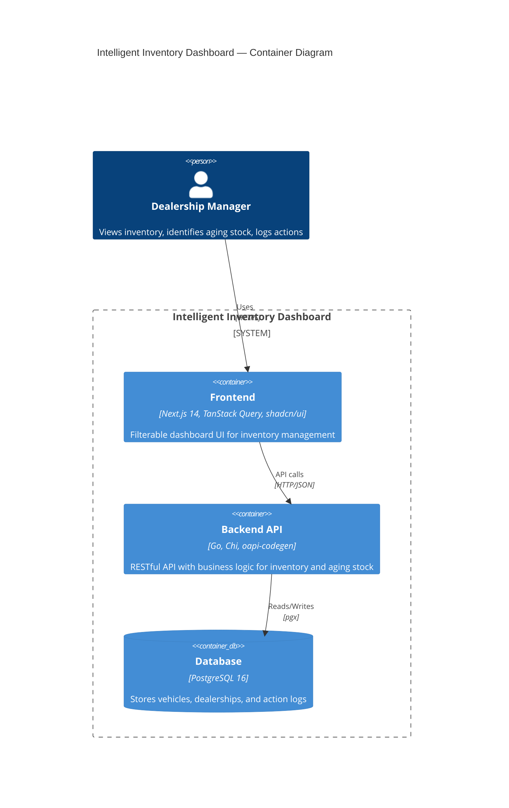
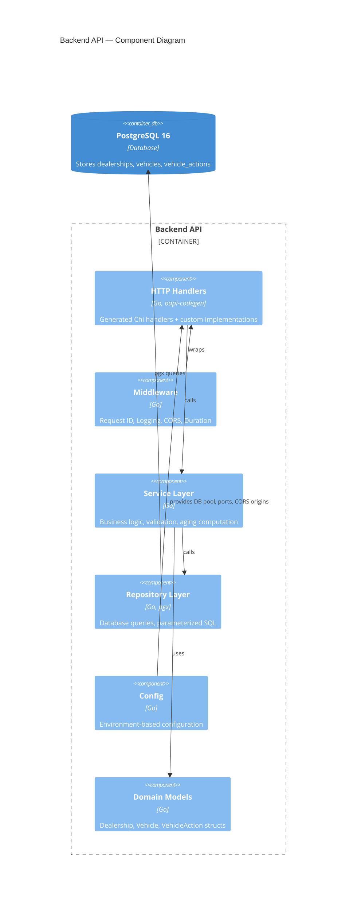
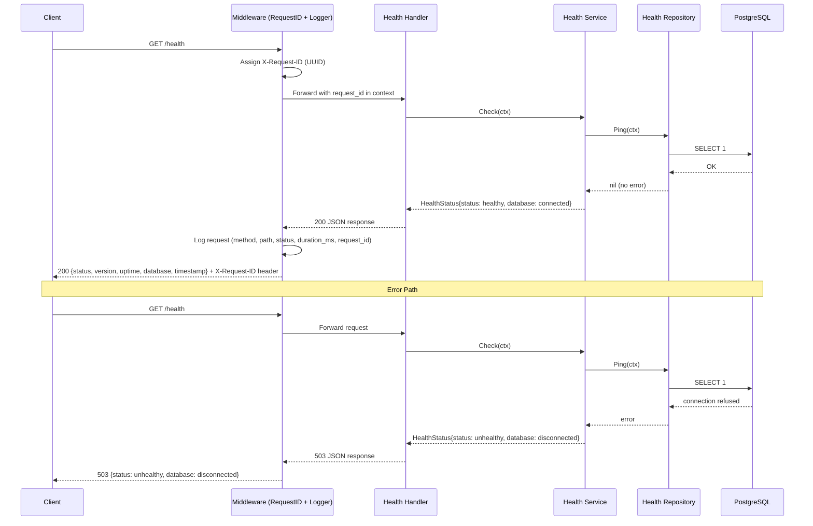

# Intelligent Inventory Dashboard — System Design Document

## 1. Architecture Overview

### 1.1 Architecture Diagram (C4 — Container Level)



### 1.2 High-Level Architecture

```
┌─────────────────┐     ┌─────────────────────┐     ┌──────────────┐
│                  │     │                      │     │              │
│   Next.js App    │────▶│   Go REST API (Chi)  │────▶│  PostgreSQL  │
│   (Browser)      │◀────│                      │◀────│              │
│                  │     │                      │     │              │
└─────────────────┘     └─────────────────────┘     └──────────────┘
      Port 3000              Port 8080                  Port 5432
```

### 1.3 Project Structure

```
intelligent-inventory-dashboard/
├── api/                        # OpenAPI spec (single source of truth)
│   └── openapi.yaml
├── backend/                    # Go backend service
│   ├── cmd/server/             # Application entry point
│   ├── internal/
│   │   ├── handler/            # HTTP handlers (generated + custom)
│   │   ├── service/            # Business logic layer
│   │   ├── repository/         # Database access layer (pgx)
│   │   └── middleware/         # Logging, CORS, request ID
│   ├── migrations/             # golang-migrate SQL files
│   ├── go.mod
│   └── Dockerfile
├── frontend/                   # Next.js frontend
│   ├── src/
│   │   ├── app/                # App Router pages
│   │   ├── components/         # UI components (shadcn/ui)
│   │   ├── lib/api/            # Generated TypeScript client
│   │   └── hooks/              # TanStack Query hooks
│   ├── package.json
│   └── Dockerfile
├── docker-compose.yaml         # Full stack orchestration
├── Makefile                    # Common commands (generate, migrate, test)
└── docs/                       # Design documents
```

### 1.4 L3 Backend Component Diagram



### 1.5 Health Check Flow



**Key Invariants:**
- Health check always attempts a real database ping — no cached result
- Request ID is always assigned, even for health checks
- Error responses never expose internal details (connection strings, stack traces)

**Error Paths:**
| Condition | Response | Rollback |
|-----------|----------|----------|
| DB connection refused | 503 `{status: unhealthy}` | None — read-only operation |
| DB timeout | 503 `{status: unhealthy}` | None — context cancellation propagates |

---

## 2. Component Descriptions

### 2.1 Frontend (Next.js 14)
- **Role:** Renders the dashboard UI for dealership managers
- **Responsibilities:**
  - Display filterable, paginated vehicle inventory table
  - Highlight aging stock (>90 days) with visual indicators
  - Provide forms for logging actions on aging vehicles
  - Show dashboard summary with aggregated stats
- **Key Libraries:** TanStack Query (data fetching/caching), shadcn/ui (components), Tailwind CSS (styling), openapi-typescript (generated types)

### 2.2 Backend API (Go + Chi)
- **Role:** RESTful API serving business logic
- **Responsibilities:**
  - Validate and route HTTP requests (oapi-codegen generated handlers)
  - Compute aging stock (vehicles with `stocked_at` > 90 days ago)
  - Enforce business rules for action logging
  - Return paginated, filterable results
  - Provide health check and observability endpoints
- **Key Libraries:** Chi (router), oapi-codegen (code generation), pgx (PostgreSQL driver), slog (structured logging), golang-migrate (migrations)

### 2.3 PostgreSQL Database
- **Role:** Persistent data storage
- **Responsibilities:**
  - Store dealership, vehicle, and action log data
  - Support efficient filtering via indexes
  - Provide transactional consistency for action logging

---

## 3. Data Model

### 3.1 Entity Relationship

```
┌──────────────┐       ┌──────────────────┐       ┌──────────────────┐
│ dealerships   │──1:N──│    vehicles       │──1:N──│ vehicle_actions   │
│              │       │                  │       │                  │
│ id (PK)      │       │ id (PK)          │       │ id (PK)          │
│ name         │       │ dealership_id(FK)│       │ vehicle_id (FK)  │
│ location     │       │ make             │       │ action_type      │
│ created_at   │       │ model            │       │ notes            │
│ updated_at   │       │ year             │       │ created_by       │
└──────────────┘       │ vin (UNIQUE)     │       │ created_at       │
                       │ price            │       └──────────────────┘
                       │ status           │
                       │ stocked_at       │
                       │ created_at       │
                       │ updated_at       │
                       └──────────────────┘
```

### 3.2 Schema

```sql
CREATE TABLE dealerships (
    id          UUID PRIMARY KEY DEFAULT gen_random_uuid(),
    name        VARCHAR(255) NOT NULL,
    location    VARCHAR(255),
    created_at  TIMESTAMPTZ NOT NULL DEFAULT NOW(),
    updated_at  TIMESTAMPTZ NOT NULL DEFAULT NOW()
);

CREATE TABLE vehicles (
    id              UUID PRIMARY KEY DEFAULT gen_random_uuid(),
    dealership_id   UUID NOT NULL REFERENCES dealerships(id),
    make            VARCHAR(100) NOT NULL,
    model           VARCHAR(100) NOT NULL,
    year            INT NOT NULL,
    vin             VARCHAR(17) UNIQUE NOT NULL,
    price           DECIMAL(12,2),
    status          VARCHAR(50) NOT NULL DEFAULT 'available',
    stocked_at      TIMESTAMPTZ NOT NULL,
    created_at      TIMESTAMPTZ NOT NULL DEFAULT NOW(),
    updated_at      TIMESTAMPTZ NOT NULL DEFAULT NOW()
);

CREATE TABLE vehicle_actions (
    id          UUID PRIMARY KEY DEFAULT gen_random_uuid(),
    vehicle_id  UUID NOT NULL REFERENCES vehicles(id),
    action_type VARCHAR(100) NOT NULL,
    notes       TEXT,
    created_by  VARCHAR(255) NOT NULL,
    created_at  TIMESTAMPTZ NOT NULL DEFAULT NOW()
);

-- Indexes for filter performance
CREATE INDEX idx_vehicles_dealership ON vehicles(dealership_id);
CREATE INDEX idx_vehicles_make ON vehicles(make);
CREATE INDEX idx_vehicles_model ON vehicles(model);
CREATE INDEX idx_vehicles_stocked_at ON vehicles(stocked_at);
CREATE INDEX idx_vehicles_status ON vehicles(status);
CREATE INDEX idx_vehicle_actions_vehicle ON vehicle_actions(vehicle_id);
```

### 3.3 Key Design Decisions
- **`stocked_at`** is separate from `created_at` — inventory date may differ from record creation
- **`vehicle_actions`** is append-only — provides full audit trail
- **Aging is computed, not stored** — `NOW() - stocked_at > 90 days` is always evaluated fresh
- **UUID primary keys** — safe for distributed systems, no sequential ID leakage

---

## 4. API Design

### 4.1 Endpoints

| Method | Endpoint | Description |
|--------|----------|-------------|
| GET | `/api/v1/dealerships` | List all dealerships |
| GET | `/api/v1/vehicles` | List vehicles (filterable, paginated) |
| GET | `/api/v1/vehicles/:id` | Get single vehicle with action history |
| POST | `/api/v1/vehicles/:id/actions` | Log an action for a vehicle |
| GET | `/api/v1/vehicles/:id/actions` | List actions for a vehicle |
| GET | `/api/v1/dashboard/summary` | Aggregated inventory stats |
| GET | `/health` | Health check |

### 4.2 Query Parameters for Vehicle List

| Parameter | Type | Description |
|-----------|------|-------------|
| `dealership_id` | UUID | Filter by dealership |
| `make` | string | Filter by vehicle make |
| `model` | string | Filter by vehicle model |
| `status` | string | Filter by status (available, sold, reserved) |
| `aging` | boolean | If true, only return vehicles >90 days in stock |
| `sort_by` | string | Column to sort by (default: stocked_at) |
| `order` | string | asc or desc (default: desc) |
| `page` | int | Page number (default: 1) |
| `page_size` | int | Items per page (default: 20, max: 100) |

### 4.3 Dashboard Summary Response

```json
{
  "total_vehicles": 150,
  "aging_vehicles": 23,
  "average_days_in_stock": 45.2,
  "by_make": [
    { "make": "Toyota", "count": 35, "aging_count": 5 },
    { "make": "Honda", "count": 28, "aging_count": 8 }
  ],
  "by_status": [
    { "status": "available", "count": 120 },
    { "status": "sold", "count": 25 },
    { "status": "reserved", "count": 5 }
  ]
}
```

---

## 5. Data Flow

### 5.1 Read Flow (Inventory List with Filters)

```
1. Manager applies filters (make: "Toyota", aging: true)
2. Next.js component calls TanStack Query hook: useVehicles({ make: "Toyota", aging: true })
3. TanStack Query checks cache → stale or missing → fetches from API
4. Generated TypeScript client sends: GET /api/v1/vehicles?make=Toyota&aging=true&page=1
5. Chi router matches route → oapi-codegen validates query params
6. Handler calls service.ListVehicles(ctx, filters)
7. Service builds query → repository.FindVehicles(ctx, filters)
8. Repository executes parameterized SQL with WHERE clauses and aging calculation
9. PostgreSQL returns matching rows
10. Response flows back: Repository → Service → Handler → JSON response
11. TanStack Query caches response, UI re-renders with filtered results
```

### 5.2 Write Flow (Log Action on Aging Vehicle)

```
1. Manager selects "Price Reduction Planned" for a vehicle, adds notes
2. Component calls mutation: useCreateAction(vehicleId, { action_type, notes, created_by })
3. TanStack Query triggers optimistic update → UI shows action immediately
4. Generated client sends: POST /api/v1/vehicles/:id/actions with JSON body
5. Chi router → oapi-codegen validates request body
6. Handler calls service.CreateAction(ctx, vehicleId, actionData)
7. Service validates vehicle exists and action_type is valid
8. Repository inserts into vehicle_actions table
9. PostgreSQL commits transaction
10. Success response → TanStack Query confirms update, invalidates vehicle query cache
11. On error → TanStack Query rolls back optimistic update
```

---

## 6. Technology Stack & Justifications

| Technology | Version | Justification |
|------------|---------|---------------|
| **Go** | 1.22+ | Strong typing, high performance, excellent concurrency, stdlib improvements in 1.22 |
| **Chi** | v5 | Lightweight, idiomatic router; stdlib `net/http` compatible; built-in oapi-codegen support |
| **oapi-codegen** | latest | Generates Chi server interfaces + Go types from OpenAPI; eliminates manual API boilerplate |
| **pgx** | v5 | High-performance native PostgreSQL driver; connection pooling; type-safe queries |
| **golang-migrate** | v4 | Explicit SQL migrations; CLI + embeddable; supports up/down migrations |
| **slog** | stdlib | Structured JSON logging; zero external dependencies; Go 1.21+ stdlib |
| **Next.js** | 14 | React framework with App Router; great DX; SSR-capable |
| **TanStack Query** | v5 | Best-in-class data fetching; caching, refetching, optimistic updates |
| **shadcn/ui** | latest | Accessible component primitives (Radix UI); fully customizable; not a dependency |
| **Tailwind CSS** | v3 | Utility-first CSS; consistent styling; purges unused styles |
| **openapi-typescript** | latest | Generates TypeScript types from OpenAPI spec; keeps frontend types in sync |
| **PostgreSQL** | 16 | Mature RDBMS; strong indexing for filters; JSONB for future flexibility |
| **Docker Compose** | v2 | One-command full stack setup; reproducible environments |
| **OpenAPI** | 3.0 | Industry standard API spec; single source of truth for Go + TypeScript types |

---

## 7. Observability Strategy

### 7.1 Structured Logging (slog)

All backend logs are JSON-formatted with consistent fields:

```json
{
  "time": "2026-03-17T10:30:00Z",
  "level": "INFO",
  "msg": "request completed",
  "request_id": "abc-123",
  "method": "GET",
  "path": "/api/v1/vehicles",
  "status": 200,
  "duration_ms": 45,
  "query_params": { "make": "Toyota", "aging": "true" }
}
```

**Log Levels:**
- `INFO` — Request lifecycle, business events (action logged, aging stock detected)
- `WARN` — Slow queries (>500ms), approaching rate limits
- `ERROR` — Failed database operations, unhandled errors

### 7.2 Health Check

`GET /health` returns:

```json
{
  "status": "healthy",
  "version": "1.0.0",
  "uptime": "2h30m",
  "database": "connected",
  "timestamp": "2026-03-17T10:30:00Z"
}
```

Used by Docker Compose healthcheck for container orchestration.

### 7.3 Request Metrics Middleware

Custom Chi middleware logs per-request:
- Request count by endpoint and status code
- Request duration (p50, p95, p99 via log aggregation)
- Error rate by endpoint

### 7.4 Business Metrics (Logged Events)

- Aging stock count per dealership (logged on dashboard summary requests)
- Actions logged per day (logged on action creation)
- Most common action types

### 7.5 Production Extension Path

For production deployment, the observability stack extends to:

```
┌─────────┐     ┌─────────────┐     ┌───────────┐
│ Go API  │────▶│ OpenTelemetry│────▶│  Jaeger   │  (Distributed Tracing)
│ (slog + │     │  Collector   │────▶│ Prometheus│  (Metrics)
│  OTEL)  │     │              │────▶│ Grafana   │  (Dashboards)
└─────────┘     └─────────────┘     └───────────┘
```

- Add OpenTelemetry SDK to instrument service/repository layers with trace spans
- Export metrics to Prometheus, traces to Jaeger
- Build Grafana dashboards for inventory KPIs and API performance

---

## 8. Frontend Pages

### 8.1 Dashboard Home (`/`)
- Summary cards: total vehicles, aging count, average days in stock
- Bar chart: vehicle count by make
- Pie chart: vehicle status breakdown
- Quick link to aging stock view

### 8.2 Inventory List (`/inventory`)
- Filterable, sortable, paginated data table
- Filter controls: make dropdown, model dropdown, status dropdown, aging toggle
- Columns: VIN, Make, Model, Year, Price, Status, Days in Stock, Last Action
- Aging vehicles highlighted with visual badge
- Click row to navigate to vehicle detail

### 8.3 Aging Stock (`/aging`)
- Pre-filtered view of vehicles >90 days in inventory
- Sorted by days in stock (descending)
- Each row shows: vehicle info, days in stock, last action taken
- Inline action button to quickly log a new action

### 8.4 Vehicle Detail (`/vehicles/:id`)
- Full vehicle information card
- Action history timeline (chronological)
- Form to log new action: action type dropdown + notes textarea
- Action types: "Price Reduction Planned", "Transfer to Another Dealership", "Auction Scheduled", "Marketing Campaign", "Wholesale Offer", "Custom"

---

## 9. Shared Type Generation Workflow

```
api/openapi.yaml  (Single Source of Truth)
       │
       ├──▶  oapi-codegen  ──▶  backend/internal/handler/api.gen.go   (Go types + Chi interfaces)
       │
       └──▶  openapi-typescript  ──▶  frontend/src/lib/api/types.ts   (TypeScript types)
```

**Makefile commands:**
```makefile
generate:        ## Generate both Go and TypeScript types from OpenAPI spec
generate-go:     ## Generate Go server code
generate-ts:     ## Generate TypeScript client types
```

Any API change starts with editing `openapi.yaml`, then running `make generate` to update both sides.

---

## 10. Scalability & Future Considerations

- **Database:** Add read replicas for heavy dashboard queries; partition `vehicles` table by `dealership_id` for multi-tenant scale
- **Caching:** Add Redis for dashboard summary caching (invalidate on writes)
- **Search:** If full-text search is needed, add PostgreSQL full-text indexes or Elasticsearch
- **Authentication:** Add JWT-based auth middleware; role-based access per dealership
- **Real-time:** WebSocket or SSE for live inventory updates across browser sessions
- **Multi-tenancy:** Current schema supports it via `dealership_id`; add row-level security in PostgreSQL

---

## 11. GenAI-Assisted Design Process

### 11.1 How GenAI Was Used

GenAI served as a **collaborative design partner** throughout the system design phase, accelerating decision-making while keeping the human architect in full control of every choice.

### 11.2 Design Phase Workflow

1. **Requirements Decomposition:** The project requirements were provided as input. GenAI helped break them into discrete architectural decisions that needed to be made (database choice, framework selection, shared type strategy, etc.).

2. **Technology Evaluation:** For each decision point, GenAI proposed 2–3 options with trade-off analysis. The human architect evaluated each recommendation and made the final selection. Examples:
   - **Shared type generation:** OpenAPI/Swagger vs Protocol Buffers vs JSON Schema — OpenAPI was selected for its natural fit with REST APIs and mature tooling for both Go and TypeScript.
   - **Database:** PostgreSQL vs SQLite vs MongoDB — PostgreSQL was selected for its relational strength, indexing capabilities, and production readiness.
   - **Go framework:** Chi vs Gin vs stdlib — Chi was selected for its idiomatic design and native oapi-codegen integration.

3. **Iterative Design Validation:** The design document was produced in sections (architecture, data model, API design, data flow, observability). Each section was reviewed and approved before proceeding to the next, ensuring no compounding errors.

4. **Schema & API Design:** GenAI drafted the database schema and REST endpoint design based on the core requirements. The human architect validated that aging stock is computed (not stored), actions are append-only for audit trails, and pagination is included for scalability.

### 11.3 What GenAI Did Well

- **Rapid exploration of trade-offs** — Comparing frameworks and libraries across Go and TypeScript ecosystems in minutes rather than hours of manual research.
- **Consistency enforcement** — Ensuring naming conventions, data types, and API patterns remained consistent across the full design document.
- **Boilerplate reduction** — Generating the complete SQL schema, API endpoint table, and data flow diagrams from high-level requirements.

### 11.4 Where Human Judgment Was Critical

- **Technology selection** — Every technology choice was a human decision. GenAI provided options and recommendations; the architect made the call.
- **Business logic decisions** — The choice to compute aging dynamically rather than store it, the append-only action log pattern, and the separation of `stocked_at` from `created_at` were all human architectural decisions.
- **Scope control** — GenAI tends toward comprehensive solutions. The architect actively scoped down to what was needed (e.g., structured logging over a full OpenTelemetry stack, basic metrics over Grafana dashboards).

### 11.5 Verification Process

- Each design section was reviewed for correctness before being incorporated.
- The final document was validated against the original requirements to ensure all three core requirements (inventory visualization, aging stock identification, actionable insights) were fully addressed.
- Technology justifications were cross-checked to ensure they matched real-world capabilities and version compatibility.
