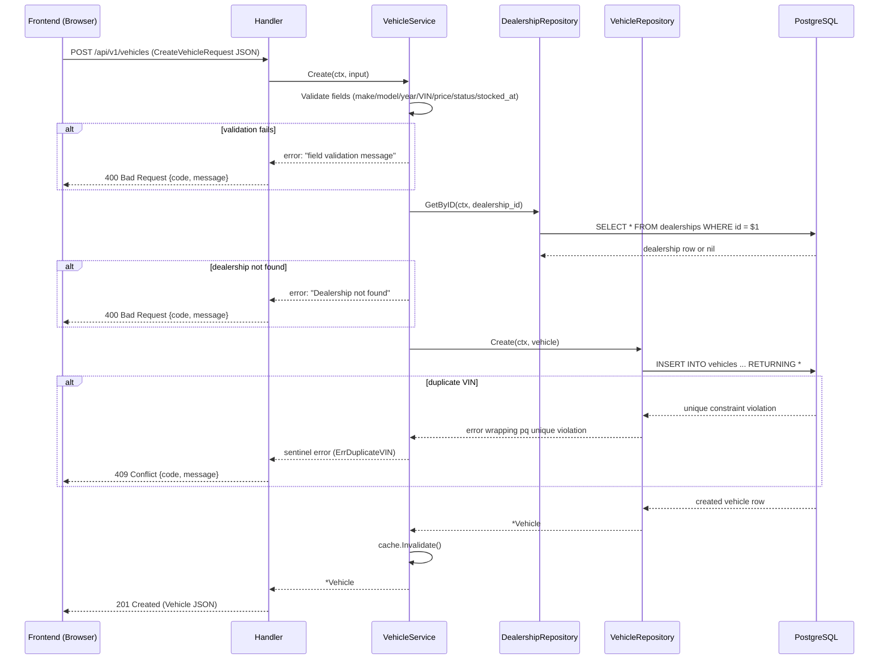

# Add Vehicle, CSV Export & Actions This Month — Implementation Plan

> **For implementation:** Use the secure-feature-pipeline skill, step: implement

**Goal:** Implement three "coming soon" features: Create Vehicle endpoint + modal, CSV export endpoint + button, and Actions This Month dashboard metric.
**Spec:** `docs/specs/2026-03-17-add-vehicle-export-spec.md`
**Architecture:** OpenAPI-first (edit `api/openapi.yaml` → `make generate`), then backend layers (handler → service → repository), then frontend (hooks → components → pages). All three features touch shared infrastructure (OpenAPI, generated types) so OpenAPI changes come first.
**Tech Stack:** Go + Chi + oapi-codegen + pgx | Next.js 14 + TanStack Query + shadcn/ui | PostgreSQL 16

---

## Security Implementation Notes

- **Input validation:** Server-side validation in service layer for all fields. OpenAPI constraints provide first-pass validation via oapi-codegen.
- **VIN uniqueness:** Enforced at service layer (check before INSERT) + database UNIQUE constraint (defense-in-depth).
- **SQL injection:** All queries use pgx parameterized queries. `sort_by` column validated against whitelist before use in SQL.
- **Export DoS:** Hard cap at 10,000 rows. Service returns 400 if match count exceeds limit.
- **stocked_at backdating:** Service rejects timestamps in the future; past dates allowed (legitimate for transfers).
- **XSS:** React renders text content, not HTML. No dangerouslySetInnerHTML used.
- **Error messages:** User-friendly only; no internal details (stack traces, SQL) exposed.
- **Duplicate VIN:** 409 Conflict with clear message, not 500.

---

## C4 Architecture Diagram Updates

Per spec, update `docs/plans/2026-03-17-system-design.md`:
- **L3 Backend Component Diagram:** Add `Create()` to VehicleRepository and VehicleService interfaces. Add `ExportCSV()` to VehicleService.
- **L3 Frontend Component Diagram:** Add `AddVehicleModal` component, `useCreateVehicle` hook, `useDealerships` hook.
- **Runtime Flow Diagrams:** Two new `sequenceDiagram` flows (Create Vehicle, CSV Export).

---

## Task Overview

| # | Task | Layer | Dependencies |
|---|------|-------|--------------|
| 0 | Update C4 & flow diagrams in system-design.md | Docs | None |
| 1 | Update OpenAPI spec + run make generate | API | None |
| 2 | Add `CreateVehicleInput` model to models.go | Backend | Task 1 |
| 3 | Add `Create()` to VehicleRepository interface + implementation | Backend | Task 2 |
| 4 | Add `ExportCSV()` to VehicleService + repository changes | Backend | Task 3 |
| 5 | Add `Create()` to VehicleService (validates, checks dealership, cache invalidate) | Backend | Task 3 |
| 6 | Update DashboardRepository to include `actions_this_month` | Backend | Task 2 |
| 7 | Add `CreateVehicle` and `ExportVehicles` handlers | Backend | Tasks 4, 5 |
| 8 | Update `GetDashboardSummary` handler for new field | Backend | Task 6 |
| 9 | Install shadcn Dialog, Input, Label, Select components | Frontend | Task 1 |
| 10 | Add `useCreateVehicle` and `useDealerships` hooks | Frontend | Task 1 |
| 11 | Build `AddVehicleModal` component | Frontend | Tasks 9, 10 |
| 12 | Wire up inventory page: enable Add Vehicle + Export buttons | Frontend | Tasks 10, 11 |
| 13 | Update dashboard page for `actions_this_month` | Frontend | Task 1 |
| 14 | Write backend service tests (Create vehicle, ExportCSV, Dashboard) | Backend | Tasks 5, 4, 6 |
| 15 | Write frontend component tests for AddVehicleModal | Frontend | Task 11 |

**Parallel-safe groups:**
- Tasks 0 and 1 can run in parallel (different files).
- Tasks 3, 4, 5, 6 are sequential (each builds on previous).
- Tasks 9, 10 can run in parallel (different files).
- Tasks 12, 13 can run in parallel (different pages).
- Tasks 14, 15 are independent of each other.

---

## Task 0: Update C4 & Runtime Flow Diagrams

**Files:**
- Modify: `docs/plans/2026-03-17-system-design.md`

**Steps:**

**Step 1: Update L3 Backend Component Diagram**

In the "VehicleService" interface box, add `Create()` and `ExportCSV()` methods.
In the "VehicleRepository" interface box, add `Create()` method.

**Step 2: Update L3 Frontend Component Diagram**

Add `AddVehicleModal` to components section.
Add `useCreateVehicle` and `useDealerships` to hooks section.

**Step 3: Add Create Vehicle sequence diagram**



Key invariants:
- Dealership existence checked before INSERT
- VIN uniqueness checked at DB level (UNIQUE constraint)
- Dashboard cache invalidated on every successful create

Error paths:
| Condition | Response | Rollback |
|-----------|----------|----------|
| Validation failure | 400 Bad Request | No DB call made |
| Dealership not found | 400 Bad Request | No INSERT attempted |
| Duplicate VIN | 409 Conflict | INSERT rolled back by DB |
| DB error | 500 Internal Server Error | No partial state |

**Step 4: Add CSV Export sequence diagram**

```mermaid
sequenceDiagram
  participant FE as Frontend (Browser)
  participant H as Handler
  participant S as VehicleService
  participant VR as VehicleRepository
  participant DB as PostgreSQL

  FE->>H: GET /api/v1/vehicles/export?filters...
  H->>S: ExportCSV(ctx, filters)
  S->>VR: ListAll(ctx, filters)
  VR->>DB: SELECT ... FROM vehicles WHERE ... (no LIMIT)
  DB-->>VR: vehicle rows (up to 10,000)
  alt > 10,000 rows
    S-->>H: error: "export exceeds 10,000 row limit"
    H-->>FE: 400 Bad Request
  end
  VR-->>S: []Vehicle
  S->>S: Encode []Vehicle to CSV bytes (encoding/csv)
  S-->>H: []byte (CSV content)
  H->>H: Set Content-Type: text/csv
  H->>H: Set Content-Disposition: attachment; filename=vehicles-export-YYYY-MM-DD.csv
  H-->>FE: 200 OK (binary CSV body)
  FE->>FE: Browser triggers file download
```

Key invariants:
- No pagination — all matching vehicles exported
- 10,000 row cap enforced in service layer
- CSV headers always present (even for empty result)

Error paths:
| Condition | Response | Rollback |
|-----------|----------|----------|
| Invalid filter params | 400 Bad Request | No DB query |
| > 10,000 matches | 400 Bad Request | DB query result discarded |
| DB error | 500 Internal Server Error | No partial file |

**Step 5: Commit**

```
docs: update system design for add vehicle, export, and dashboard metric
```

---

## Task 1: Update OpenAPI Spec + Run `make generate`

**Files:**
- Modify: `api/openapi.yaml`
- Auto-generated (do NOT edit manually): `backend/internal/handler/api.gen.go`, `frontend/src/lib/api/types.ts`

**Security notes:** All field constraints (minLength, maxLength, pattern, minimum, maximum, enum) go into OpenAPI first — oapi-codegen will enforce them at the HTTP layer before the service layer even sees the data.

**Step 1: Add `POST /api/v1/vehicles` endpoint to openapi.yaml**

In the `paths` section, under `/api/v1/vehicles`, add a `post` operation alongside the existing `get`:

```yaml
  /api/v1/vehicles:
    get:
      # ... existing listVehicles operation unchanged ...
    post:
      operationId: createVehicle
      summary: Create a new vehicle
      description: Adds a new vehicle to the inventory.
      tags:
        - vehicles
      requestBody:
        required: true
        content:
          application/json:
            schema:
              $ref: "#/components/schemas/CreateVehicleRequest"
      responses:
        "201":
          description: Vehicle created successfully
          content:
            application/json:
              schema:
                $ref: "#/components/schemas/Vehicle"
        "400":
          description: Invalid request body or validation error
          content:
            application/json:
              schema:
                $ref: "#/components/schemas/ErrorResponse"
        "409":
          description: A vehicle with this VIN already exists
          content:
            application/json:
              schema:
                $ref: "#/components/schemas/ErrorResponse"
        "500":
          description: Internal server error
          content:
            application/json:
              schema:
                $ref: "#/components/schemas/ErrorResponse"
```

**Step 2: Add `GET /api/v1/vehicles/export` endpoint**

Add as a new path entry **before** `/api/v1/vehicles/{id}` (important — oapi-codegen routes in order):

```yaml
  /api/v1/vehicles/export:
    get:
      operationId: exportVehicles
      summary: Export filtered vehicles as CSV
      description: Exports all vehicles matching the given filters as a CSV file. No pagination — exports all matching records (max 10,000).
      tags:
        - vehicles
      parameters:
        - name: dealership_id
          in: query
          schema:
            type: string
            format: uuid
        - name: make
          in: query
          schema:
            type: string
            maxLength: 100
        - name: model
          in: query
          schema:
            type: string
            maxLength: 100
        - name: status
          in: query
          schema:
            type: string
            enum:
              - available
              - sold
              - reserved
        - name: aging
          in: query
          schema:
            type: boolean
        - name: sort_by
          in: query
          schema:
            type: string
            enum:
              - stocked_at
              - price
              - year
              - make
            default: stocked_at
        - name: order
          in: query
          schema:
            type: string
            enum:
              - asc
              - desc
            default: desc
      responses:
        "200":
          description: CSV file download
          content:
            text/csv:
              schema:
                type: string
                format: binary
        "400":
          description: Invalid query parameters or export limit exceeded
          content:
            application/json:
              schema:
                $ref: "#/components/schemas/ErrorResponse"
        "500":
          description: Internal server error
          content:
            application/json:
              schema:
                $ref: "#/components/schemas/ErrorResponse"
```

**Step 3: Add `CreateVehicleRequest` schema to components/schemas**

```yaml
    CreateVehicleRequest:
      type: object
      required:
        - dealership_id
        - make
        - model
        - year
        - vin
        - status
      properties:
        dealership_id:
          type: string
          format: uuid
        make:
          type: string
          minLength: 1
          maxLength: 100
        model:
          type: string
          minLength: 1
          maxLength: 100
        year:
          type: integer
          minimum: 1900
          maximum: 2100
        vin:
          type: string
          minLength: 17
          maxLength: 17
          pattern: "^[A-HJ-NPR-Z0-9]{17}$"
        price:
          type: number
          format: double
          minimum: 0
          maximum: 10000000
        status:
          type: string
          enum:
            - available
            - sold
            - reserved
        stocked_at:
          type: string
          format: date-time
```

**Step 4: Update `DashboardSummary` schema**

Add `actions_this_month` to the required list and properties:

```yaml
    DashboardSummary:
      type: object
      required:
        - total_vehicles
        - aging_vehicles
        - average_days_in_stock
        - actions_this_month
        - by_make
        - by_status
      properties:
        total_vehicles:
          type: integer
        aging_vehicles:
          type: integer
        average_days_in_stock:
          type: number
          format: double
        actions_this_month:
          type: integer
          description: Number of vehicle actions created in the last 30 days
        by_make:
          type: array
          items:
            $ref: "#/components/schemas/MakeSummary"
        by_status:
          type: array
          items:
            $ref: "#/components/schemas/StatusSummary"
```

**Step 5: Run code generation and verify it compiles**

```bash
make generate
cd backend && go build ./...
```

Expected: No errors. Generated files updated at `backend/internal/handler/api.gen.go` and `frontend/src/lib/api/types.ts`.

**Step 6: Commit**

```
feat(api): add createVehicle, exportVehicles endpoints and actions_this_month to OpenAPI spec
```

---

## Task 2: Add `CreateVehicleInput` Model

**Files:**
- Modify: `backend/internal/models/models.go`

**Security notes:** Model is internal only — never serialized directly to JSON. Validation happens in service before populating this struct.

**Step 1: Add the model**

In `models.go`, alongside existing `CreateActionInput`, add:

```go
// CreateVehicleInput contains validated data for creating a new vehicle.
type CreateVehicleInput struct {
    DealershipID uuid.UUID
    Make         string
    Model        string
    Year         int
    VIN          string
    Price        *float64 // optional
    Status       string
    StockedAt    time.Time // defaults to now if not provided
}
```

**Step 2: Verify build still passes**

```bash
cd backend && go build ./...
```

**Step 3: Commit**

```
feat(models): add CreateVehicleInput model
```

---

## Task 3: Add `Create()` to VehicleRepository

**Files:**
- Modify: `backend/internal/repository/repository.go` (interface)
- Modify: `backend/internal/repository/vehicle.go` (implementation)
- Modify: `backend/internal/service/vehicle_action_test.go` (mock needs Create method)

**Security notes:** Uses pgx parameterized INSERT. UNIQUE constraint on `vin` column causes `pgconn.PgError` with Code `23505` on duplicate — catch this to return a typed error.

**Step 1: Define a sentinel error for duplicate VIN**

In `backend/internal/repository/repository.go`, add:

```go
import "errors"

// ErrDuplicateVIN is returned when an INSERT violates the vehicles.vin UNIQUE constraint.
var ErrDuplicateVIN = errors.New("duplicate VIN")
```

**Step 2: Update VehicleRepository interface**

```go
type VehicleRepository interface {
    List(ctx context.Context, filters models.VehicleFilters) ([]models.Vehicle, int, error)
    GetByID(ctx context.Context, id uuid.UUID) (*models.Vehicle, error)
    Create(ctx context.Context, input models.CreateVehicleInput) (*models.Vehicle, error)
}
```

**Step 3: Write the failing test for Create (in a new file)**

Create `backend/internal/repository/vehicle_create_test.go` — however, repository tests require a real DB (integration tests). Skip unit test here; service layer tests (Task 14) will cover the logic. Write a build-only stub to verify the interface is satisfied.

Instead: verify mock in `vehicle_action_test.go` compiles — the existing `mockVehicleRepoForAction` implements `VehicleRepository`, so it needs a `Create` method added:

```go
func (m *mockVehicleRepoForAction) Create(_ context.Context, _ models.CreateVehicleInput) (*models.Vehicle, error) {
    return nil, nil
}
```

**Step 4: Implement `Create()` in vehicle.go**

```go
func (r *vehicleRepository) Create(ctx context.Context, input models.CreateVehicleInput) (*models.Vehicle, error) {
    query := `
        INSERT INTO vehicles (dealership_id, make, model, year, vin, price, status, stocked_at)
        VALUES ($1, $2, $3, $4, $5, $6, $7, $8)
        RETURNING id, dealership_id, make, model, year, vin, price, status, stocked_at,
                  created_at, updated_at,
                  EXTRACT(EPOCH FROM NOW() - stocked_at)::int / 86400 AS days_in_stock`

    var v models.Vehicle
    err := r.db.QueryRow(ctx, query,
        input.DealershipID,
        input.Make,
        input.Model,
        input.Year,
        input.VIN,
        input.Price,
        input.Status,
        input.StockedAt,
    ).Scan(
        &v.ID, &v.DealershipID, &v.Make, &v.Model, &v.Year, &v.VIN,
        &v.Price, &v.Status, &v.StockedAt, &v.CreatedAt, &v.UpdatedAt,
        &v.DaysInStock,
    )
    if err != nil {
        var pgErr *pgconn.PgError
        if errors.As(err, &pgErr) && pgErr.Code == "23505" {
            return nil, ErrDuplicateVIN
        }
        return nil, fmt.Errorf("creating vehicle: %w", err)
    }
    v.IsAging = v.DaysInStock > 90
    v.Actions = []models.VehicleAction{}
    return &v, nil
}
```

Import `"github.com/jackc/pgx/v5/pgconn"` (already used in repo package).

**Step 5: Run tests and verify build**

```bash
cd backend && go test -v -race ./internal/service/... && go build ./...
```

Expected: All existing tests still pass. Build succeeds.

**Step 6: Commit**

```
feat(repository): add VehicleRepository.Create with duplicate VIN detection
```

---

## Task 4: Add `ListAll()` to VehicleRepository + `ExportCSV()` to VehicleService

**Files:**
- Modify: `backend/internal/repository/repository.go` (interface)
- Modify: `backend/internal/repository/vehicle.go` (implementation)
- Modify: `backend/internal/service/service.go` (interface)
- Modify: `backend/internal/service/vehicle.go` (implementation)

**Security notes:** `ListAll` must apply the same sort column whitelist as `List`. No LIMIT is set, but the service enforces a 10,000-row cap by checking count before fetching.

**Step 1: Add `ListAll` to VehicleRepository interface**

```go
type VehicleRepository interface {
    List(ctx context.Context, filters models.VehicleFilters) ([]models.Vehicle, int, error)
    ListAll(ctx context.Context, filters models.VehicleFilters) ([]models.Vehicle, int, error) // for export — no pagination
    GetByID(ctx context.Context, id uuid.UUID) (*models.Vehicle, error)
    Create(ctx context.Context, input models.CreateVehicleInput) (*models.Vehicle, error)
}
```

**Step 2: Update mock to satisfy the new interface**

In `backend/internal/service/vehicle_action_test.go`:

```go
func (m *mockVehicleRepoForAction) ListAll(_ context.Context, _ models.VehicleFilters) ([]models.Vehicle, int, error) {
    return nil, 0, nil
}
```

In `backend/internal/service/vehicle_test.go` (the `mockVehicleRepo`), add:

```go
func (m *mockVehicleRepo) ListAll(_ context.Context, _ models.VehicleFilters) ([]models.Vehicle, int, error) {
    return m.vehicles, m.total, m.err
}

func (m *mockVehicleRepo) Create(_ context.Context, _ models.CreateVehicleInput) (*models.Vehicle, error) {
    return nil, nil
}
```

**Step 3: Implement `ListAll` in vehicle.go (repository)**

Reuse the `buildWhereClause` logic from `List`. Key difference: no `LIMIT`/`OFFSET`. Returns count + rows.

```go
func (r *vehicleRepository) ListAll(ctx context.Context, filters models.VehicleFilters) ([]models.Vehicle, int, error) {
    // Validate sort column (whitelist) — same as List
    sortCol := validateSortColumn(filters.SortBy)
    sortOrder := validateSortOrder(filters.Order)

    conditions, args := buildConditions(filters)
    whereClause := buildWhereClause(conditions)

    // Count first
    var total int
    countQuery := fmt.Sprintf("SELECT COUNT(*) FROM vehicles v %s", whereClause)
    if err := r.db.QueryRow(ctx, countQuery, args...).Scan(&total); err != nil {
        return nil, 0, fmt.Errorf("counting vehicles for export: %w", err)
    }

    // Fetch all rows (no LIMIT/OFFSET)
    query := fmt.Sprintf(`
        SELECT v.id, v.dealership_id, v.make, v.model, v.year, v.vin, v.price,
               v.status, v.stocked_at, v.created_at, v.updated_at,
               EXTRACT(EPOCH FROM NOW() - v.stocked_at)::int / 86400 AS days_in_stock
        FROM vehicles v %s
        ORDER BY %s %s`, whereClause, sortCol, sortOrder)

    rows, err := r.db.Query(ctx, query, args...)
    if err != nil {
        return nil, 0, fmt.Errorf("querying vehicles for export: %w", err)
    }
    defer rows.Close()

    var vehicles []models.Vehicle
    for rows.Next() {
        var v models.Vehicle
        if err := rows.Scan(&v.ID, &v.DealershipID, &v.Make, &v.Model, &v.Year,
            &v.VIN, &v.Price, &v.Status, &v.StockedAt, &v.CreatedAt, &v.UpdatedAt,
            &v.DaysInStock); err != nil {
            return nil, 0, fmt.Errorf("scanning vehicle for export: %w", err)
        }
        v.IsAging = v.DaysInStock > 90
        vehicles = append(vehicles, v)
    }
    if err := rows.Err(); err != nil {
        return nil, 0, fmt.Errorf("iterating vehicles for export: %w", err)
    }
    if vehicles == nil {
        vehicles = []models.Vehicle{}
    }
    return vehicles, total, nil
}
```

Note: refactor `List` to use the same `buildConditions`/`buildWhereClause` helpers to avoid duplication.

**Step 4: Add `ExportCSV` to VehicleService interface**

In `backend/internal/service/service.go`:

```go
type VehicleService interface {
    List(ctx context.Context, filters models.VehicleFilters) (*models.PaginatedVehicles, error)
    GetByID(ctx context.Context, id uuid.UUID) (*models.Vehicle, error)
    Create(ctx context.Context, input models.CreateVehicleInput) (*models.Vehicle, error)
    ExportCSV(ctx context.Context, filters models.VehicleFilters) ([]byte, error)
}
```

**Step 5: Implement `ExportCSV` in vehicle.go (service)**

```go
const exportRowLimit = 10_000

func (s *vehicleService) ExportCSV(ctx context.Context, filters models.VehicleFilters) ([]byte, error) {
    // Remove pagination for export
    filters.Page = 1
    filters.PageSize = 0 // signals ListAll to skip pagination

    vehicles, total, err := s.repo.ListAll(ctx, filters)
    if err != nil {
        return nil, fmt.Errorf("fetching vehicles for export: %w", err)
    }
    if total > exportRowLimit {
        return nil, fmt.Errorf("export exceeds %d row limit: found %d vehicles; apply filters to narrow results", exportRowLimit, total)
    }

    var buf bytes.Buffer
    w := csv.NewWriter(&buf)

    // Write header row
    header := []string{
        "ID", "VIN", "Make", "Model", "Year", "Price",
        "Status", "Stocked At", "Days in Stock", "Is Aging", "Created At",
    }
    if err := w.Write(header); err != nil {
        return nil, fmt.Errorf("writing CSV header: %w", err)
    }

    // Write data rows
    for _, v := range vehicles {
        price := ""
        if v.Price != nil {
            price = fmt.Sprintf("%.2f", *v.Price)
        }
        row := []string{
            v.ID.String(),
            v.VIN,
            v.Make,
            v.Model,
            strconv.Itoa(v.Year),
            price,
            v.Status,
            v.StockedAt.UTC().Format(time.RFC3339),
            strconv.Itoa(v.DaysInStock),
            strconv.FormatBool(v.IsAging),
            v.CreatedAt.UTC().Format(time.RFC3339),
        }
        if err := w.Write(row); err != nil {
            return nil, fmt.Errorf("writing CSV row: %w", err)
        }
    }

    w.Flush()
    if err := w.Error(); err != nil {
        return nil, fmt.Errorf("flushing CSV writer: %w", err)
    }
    return buf.Bytes(), nil
}
```

**Step 6: Run tests + vet + build**

```bash
cd backend && go test -v -race ./internal/service/... && go vet ./... && go build ./...
```

**Step 7: Commit**

```
feat(service): add VehicleService.ExportCSV and VehicleRepository.ListAll
```

---

## Task 5: Add `Create()` to VehicleService

**Files:**
- Modify: `backend/internal/service/vehicle.go`
- Modify: `backend/internal/service/service.go` (if not already updated in Task 4)
- Dependency: Needs `DealershipRepository.GetByID` — check if it exists

**Security notes:** Service is the main validation gate. Validates all fields, checks dealership existence, checks VIN pattern, rejects future `stocked_at`. Wraps `ErrDuplicateVIN` from repo into a typed check for the handler.

**Step 1: Verify DealershipRepository has GetByID**

Check `backend/internal/repository/repository.go` for `DealershipRepository`. If it only has `List`, add `GetByID`:

```go
type DealershipRepository interface {
    List(ctx context.Context) ([]models.Dealership, error)
    GetByID(ctx context.Context, id uuid.UUID) (*models.Dealership, error)
}
```

And implement in `backend/internal/repository/dealership.go`:

```go
func (r *dealershipRepository) GetByID(ctx context.Context, id uuid.UUID) (*models.Dealership, error) {
    var d models.Dealership
    err := r.db.QueryRow(ctx,
        `SELECT id, name, location, created_at, updated_at FROM dealerships WHERE id = $1`, id,
    ).Scan(&d.ID, &d.Name, &d.Location, &d.CreatedAt, &d.UpdatedAt)
    if errors.Is(err, pgx.ErrNoRows) {
        return nil, nil
    }
    if err != nil {
        return nil, fmt.Errorf("getting dealership by ID: %w", err)
    }
    return &d, nil
}
```

**Step 2: Add `dealershipRepo` to vehicleService struct**

```go
type vehicleService struct {
    repo            repository.VehicleRepository
    dealershipRepo  repository.DealershipRepository
    cache           CacheInvalidator
}

func NewVehicleService(repo repository.VehicleRepository, dealershipRepo repository.DealershipRepository, cache CacheInvalidator) VehicleService {
    return &vehicleService{repo: repo, dealershipRepo: dealershipRepo, cache: cache}
}
```

Update constructor call in `cmd/server/main.go` (or wherever services are wired up).

**Step 3: Implement `Create` in vehicle service**

```go
var vinPattern = regexp.MustCompile(`^[A-HJ-NPR-Z0-9]{17}$`)

func (s *vehicleService) Create(ctx context.Context, input models.CreateVehicleInput) (*models.Vehicle, error) {
    // Trim and validate Make
    input.Make = strings.TrimSpace(input.Make)
    if len(input.Make) == 0 || len(input.Make) > 100 {
        return nil, fmt.Errorf("make must be 1-100 characters")
    }

    // Trim and validate Model
    input.Model = strings.TrimSpace(input.Model)
    if len(input.Model) == 0 || len(input.Model) > 100 {
        return nil, fmt.Errorf("model must be 1-100 characters")
    }

    // Validate Year
    if input.Year < 1900 || input.Year > 2100 {
        return nil, fmt.Errorf("year must be between 1900 and 2100")
    }

    // Validate VIN
    input.VIN = strings.ToUpper(strings.TrimSpace(input.VIN))
    if !vinPattern.MatchString(input.VIN) {
        return nil, fmt.Errorf("VIN must be exactly 17 uppercase alphanumeric characters (excluding I, O, Q)")
    }

    // Validate Price (if provided)
    if input.Price != nil {
        if *input.Price < 0 {
            return nil, fmt.Errorf("price cannot be negative")
        }
        if *input.Price > 10_000_000 {
            return nil, fmt.Errorf("price cannot exceed 10,000,000")
        }
    }

    // Validate Status
    validStatuses := map[string]bool{"available": true, "sold": true, "reserved": true}
    if !validStatuses[input.Status] {
        return nil, fmt.Errorf("status must be available, sold, or reserved")
    }

    // Handle StockedAt default + future check
    if input.StockedAt.IsZero() {
        input.StockedAt = time.Now().UTC()
    } else if input.StockedAt.After(time.Now()) {
        return nil, fmt.Errorf("stocked date cannot be in the future")
    }

    // Check dealership exists
    dealership, err := s.dealershipRepo.GetByID(ctx, input.DealershipID)
    if err != nil {
        return nil, fmt.Errorf("checking dealership: %w", err)
    }
    if dealership == nil {
        return nil, fmt.Errorf("dealership not found")
    }

    // Create vehicle
    vehicle, err := s.repo.Create(ctx, input)
    if err != nil {
        if errors.Is(err, repository.ErrDuplicateVIN) {
            return nil, repository.ErrDuplicateVIN
        }
        return nil, fmt.Errorf("creating vehicle: %w", err)
    }

    // Invalidate dashboard cache
    s.cache.Invalidate()

    return vehicle, nil
}
```

**Step 4: Run tests**

```bash
cd backend && go test -v -race ./internal/service/... && go vet ./... && go build ./...
```

**Step 5: Commit**

```
feat(service): add VehicleService.Create with full validation and cache invalidation
```

---

## Task 6: Update Dashboard Repository and Model for `actions_this_month`

**Files:**
- Modify: `backend/internal/models/models.go`
- Modify: `backend/internal/repository/dashboard.go`
- Modify: `backend/internal/handler/handler.go` (response mapping)

**Security notes:** Read-only query. COUNT is aggregate — no injection surface. No new trust boundary crossed.

**Step 1: Add `ActionsThisMonth` to DashboardSummary model**

In `models.go`:

```go
type DashboardSummary struct {
    TotalVehicles      int
    AgingVehicles      int
    AvgDaysInStock     float64
    ActionsThisMonth   int
    ByMake             []MakeSummary
    ByStatus           []StatusSummary
}
```

**Step 2: Update dashboard repository query**

In `backend/internal/repository/dashboard.go`, add a new query to `GetSummary`:

```go
// Query 4: Actions in last 30 days
var actionsThisMonth int
err = r.db.QueryRow(ctx, `
    SELECT COUNT(*) FROM vehicle_actions
    WHERE created_at >= NOW() - INTERVAL '30 days'
`).Scan(&actionsThisMonth)
if err != nil {
    return nil, fmt.Errorf("counting actions this month: %w", err)
}
summary.ActionsThisMonth = actionsThisMonth
```

**Step 3: Update handler response mapping**

In `handler.go`, in the `GetDashboardSummary` handler, add to the response struct:

```go
ActionsThisMonth: summary.ActionsThisMonth,
```

(The exact field name in the generated struct will match the OpenAPI schema field `actions_this_month`.)

**Step 4: Verify build**

```bash
cd backend && go build ./...
```

**Step 5: Commit**

```
feat(repository): add actions_this_month count to DashboardRepository.GetSummary
```

---

## Task 7: Add `CreateVehicle` and `ExportVehicles` HTTP Handlers

**Files:**
- Modify: `backend/internal/handler/handler.go`

**Security notes:**
- `CreateVehicle`: Map `ErrDuplicateVIN` → 409. Map validation errors (strings.Contains checks) → 400. All other errors → 500.
- `ExportVehicles`: Export limit exceeded → 400. Set `Content-Type: text/csv` and `Content-Disposition` header before writing body. Never expose internal error messages.

**Step 1: Add `CreateVehicle` handler**

```go
func (s *Server) CreateVehicle(ctx context.Context, request CreateVehicleRequestObject) (CreateVehicleResponseObject, error) {
    body := request.Body

    // Map OpenAPI request to service input
    input := models.CreateVehicleInput{
        Make:   body.Make,
        Model:  body.Model,
        Year:   body.Year,
        VIN:    body.Vin,
        Status: string(body.Status),
    }

    // Parse dealership_id UUID
    dealershipID, err := uuid.Parse(body.DealershipId.String())
    if err != nil {
        return CreateVehicle400JSONResponse{Code: 400, Message: "invalid dealership_id"}, nil
    }
    input.DealershipID = dealershipID

    // Optional price
    if body.Price != nil {
        p := *body.Price
        input.Price = &p
    }

    // Optional stocked_at
    if body.StockedAt != nil {
        input.StockedAt = *body.StockedAt
    }

    vehicle, err := s.vehicleSvc.Create(ctx, input)
    if err != nil {
        if errors.Is(err, repository.ErrDuplicateVIN) {
            return CreateVehicle409JSONResponse{Code: 409, Message: "A vehicle with this VIN already exists"}, nil
        }
        if isValidationError(err) {
            return CreateVehicle400JSONResponse{Code: 400, Message: err.Error()}, nil
        }
        return CreateVehicle500JSONResponse{Code: 500, Message: "Failed to create vehicle"}, nil
    }

    resp := modelVehicleToResponse(*vehicle)
    return CreateVehicle201JSONResponse(resp), nil
}

// isValidationError returns true for known validation error messages from the service layer.
func isValidationError(err error) bool {
    msg := err.Error()
    validationPrefixes := []string{
        "make must", "model must", "year must", "VIN must",
        "price cannot", "status must", "stocked date cannot",
        "dealership not found",
    }
    for _, prefix := range validationPrefixes {
        if strings.HasPrefix(msg, prefix) {
            return true
        }
    }
    return false
}
```

**Step 2: Add `ExportVehicles` handler**

The export endpoint returns `text/csv`, not JSON. oapi-codegen generates a response object for the `200 text/csv` response. Check the generated code for the exact type. The handler writes raw bytes:

```go
func (s *Server) ExportVehicles(ctx context.Context, request ExportVehiclesRequestObject) (ExportVehiclesResponseObject, error) {
    // Build filters from query params (same as ListVehicles, no pagination)
    filters := exportParamsToFilters(request.Params)

    csvBytes, err := s.vehicleSvc.ExportCSV(ctx, filters)
    if err != nil {
        if strings.Contains(err.Error(), "export exceeds") {
            return ExportVehicles400JSONResponse{Code: 400, Message: err.Error()}, nil
        }
        return ExportVehicles500JSONResponse{Code: 500, Message: "Failed to generate export"}, nil
    }

    // Set filename with today's date
    filename := fmt.Sprintf("vehicles-export-%s.csv", time.Now().UTC().Format("2006-01-02"))
    return ExportVehicles200TextcsvResponse{
        Body:                  bytes.NewReader(csvBytes),
        ContentLength:         int64(len(csvBytes)),
        ContentDisposition:    fmt.Sprintf("attachment; filename=%q", filename),
    }, nil
}
```

Note: The exact generated response type for `text/csv` must be verified against `api.gen.go` after `make generate`. If oapi-codegen does not generate a typed response for binary content, use a custom `http.ResponseWriter` approach with the `StrictHandlerFunc` pattern.

**Step 3: Add `exportParamsToFilters` helper**

```go
func exportParamsToFilters(p ExportVehiclesParams) models.VehicleFilters {
    filters := models.VehicleFilters{
        SortBy: "stocked_at",
        Order:  "desc",
    }
    if p.DealershipId != nil {
        id := uuid.UUID(*p.DealershipId)
        filters.DealershipID = &id
    }
    if p.Make != nil {
        filters.Make = *p.Make
    }
    if p.Model != nil {
        filters.Model = *p.Model
    }
    if p.Status != nil {
        filters.Status = string(*p.Status)
    }
    if p.Aging != nil {
        filters.Aging = p.Aging
    }
    if p.SortBy != nil {
        filters.SortBy = string(*p.SortBy)
    }
    if p.Order != nil {
        filters.Order = string(*p.Order)
    }
    return filters
}
```

**Step 4: Build and run existing tests**

```bash
cd backend && go build ./... && go test -v -race ./internal/...
```

**Step 5: Commit**

```
feat(handler): add CreateVehicle and ExportVehicles HTTP handlers
```

---

## Task 8: Update `GetDashboardSummary` Handler

**Files:**
- Modify: `backend/internal/handler/handler.go`

**Step 1: Find the existing `GetDashboardSummary` handler and update the response mapping**

The current response maps `TotalVehicles`, `AgingVehicles`, `AverageDaysInStock`, `ByMake`, `ByStatus`. Add:

```go
ActionsThisMonth: summary.ActionsThisMonth,
```

(The generated field name from OpenAPI `actions_this_month` becomes `ActionsThisMonth` in the Go struct.)

**Step 2: Build**

```bash
cd backend && go build ./...
```

**Step 3: Commit**

```
feat(handler): map actions_this_month in dashboard summary response
```

---

## Task 9: Install shadcn Dialog, Input, Label, Select Components

**Files:**
- Create: `frontend/src/components/ui/dialog.tsx`
- Create: `frontend/src/components/ui/input.tsx`
- Create: `frontend/src/components/ui/label.tsx`
- Create: `frontend/src/components/ui/select.tsx`

**Security notes:** These are local shadcn components — code is copied into the project, not fetched at runtime. Pin the version used.

**Step 1: Run shadcn add commands**

```bash
cd frontend
npx shadcn@latest add dialog
npx shadcn@latest add input
npx shadcn@latest add label
npx shadcn@latest add select
```

**Step 2: Verify components were created**

```bash
ls frontend/src/components/ui/
```

Expected: `dialog.tsx`, `input.tsx`, `label.tsx`, `select.tsx` present alongside existing `button.tsx`, `card.tsx`, etc.

**Step 3: Fix any import issues**

The existing project uses `@base-ui/react` for button and badge, but shadcn Dialog/Input/Select/Label use Radix UI primitives. Verify `@radix-ui/react-dialog`, `@radix-ui/react-label`, `@radix-ui/react-select` are installed:

```bash
cd frontend && npm install
```

**Step 4: Verify frontend builds**

```bash
cd frontend && npm run build
```

**Step 5: Commit**

```
feat(ui): add shadcn Dialog, Input, Label, Select components
```

---

## Task 10: Add `useCreateVehicle` and `useDealerships` Hooks

**Files:**
- Create: `frontend/src/hooks/use-create-vehicle.ts`
- Create: `frontend/src/hooks/use-dealerships.ts`

**Security notes:** `useCreateVehicle` sends user-entered data to the backend — all validation is server-side. The hook should propagate errors so the component can display them.

**Step 1: Write failing tests for both hooks**

Create `frontend/src/hooks/__tests__/use-create-vehicle.test.ts` and `use-dealerships.test.ts` following the pattern from existing hook tests.

**Step 2: Implement `useDealerships`**

```typescript
// frontend/src/hooks/use-dealerships.ts
import { useQuery } from "@tanstack/react-query";
import { apiFetch } from "@/lib/api/client";
import type { Dealership } from "@/lib/api/types";

export function useDealerships() {
  return useQuery({
    queryKey: ["dealerships"],
    queryFn: () => apiFetch<Dealership[]>("/api/v1/dealerships"),
    staleTime: 5 * 60 * 1000, // 5 minutes — dealerships rarely change
  });
}
```

**Step 3: Implement `useCreateVehicle`**

```typescript
// frontend/src/hooks/use-create-vehicle.ts
import { useMutation, useQueryClient } from "@tanstack/react-query";
import { apiFetch } from "@/lib/api/client";
import type { Vehicle, CreateVehicleRequest } from "@/lib/api/types";

export function useCreateVehicle() {
  const queryClient = useQueryClient();
  return useMutation({
    mutationFn: (data: CreateVehicleRequest) =>
      apiFetch<Vehicle>("/api/v1/vehicles", {
        method: "POST",
        body: JSON.stringify(data),
      }),
    onSuccess: () => {
      queryClient.invalidateQueries({ queryKey: ["vehicles"] });
      queryClient.invalidateQueries({ queryKey: ["dashboard"] });
    },
  });
}
```

**Step 4: Run tests**

```bash
cd frontend && npm test -- --testPathPattern=use-create-vehicle --testPathPattern=use-dealerships
```

**Step 5: Commit**

```
feat(hooks): add useCreateVehicle and useDealerships TanStack Query hooks
```

---

## Task 11: Build `AddVehicleModal` Component

**Files:**
- Create: `frontend/src/components/add-vehicle-modal.tsx`

**Security notes:** VIN field auto-uppercases and validates pattern client-side (UX only — server validates authoritatively). No `dangerouslySetInnerHTML`. Form state reset on successful submit. Error messages displayed from server response (not raw error objects).

**Step 1: Write component test**

Create `frontend/src/components/__tests__/add-vehicle-modal.test.tsx`:

- Test: modal opens on button trigger
- Test: all 7 form fields render
- Test: VIN input auto-uppercases
- Test: submit disabled when required fields empty
- Test: shows loading state during submission
- Test: shows server error message on failure
- Test: calls onSuccess and closes on success

**Step 2: Implement `AddVehicleModal`**

```tsx
// frontend/src/components/add-vehicle-modal.tsx
"use client";

import { useState } from "react";
import { Dialog, DialogContent, DialogHeader, DialogTitle, DialogFooter } from "@/components/ui/dialog";
import { Button } from "@/components/ui/button";
import { Input } from "@/components/ui/input";
import { Label } from "@/components/ui/label";
import { Select, SelectContent, SelectItem, SelectTrigger, SelectValue } from "@/components/ui/select";
import { useCreateVehicle } from "@/hooks/use-create-vehicle";
import { useDealerships } from "@/hooks/use-dealerships";
import type { CreateVehicleRequest } from "@/lib/api/types";

interface AddVehicleModalProps {
  open: boolean;
  onOpenChange: (open: boolean) => void;
}

const CURRENT_YEAR = new Date().getFullYear();
const TODAY = new Date().toISOString().split("T")[0];

export function AddVehicleModal({ open, onOpenChange }: AddVehicleModalProps) {
  const { data: dealerships } = useDealerships();
  const { mutate: createVehicle, isPending, error, reset } = useCreateVehicle();

  const [form, setForm] = useState({
    dealership_id: "",
    make: "",
    model: "",
    year: String(CURRENT_YEAR),
    vin: "",
    price: "",
    status: "available" as "available" | "sold" | "reserved",
    stocked_at: TODAY,
  });
  const [fieldErrors, setFieldErrors] = useState<Record<string, string>>({});

  function handleChange(field: string, value: string) {
    setForm((prev) => ({ ...prev, [field]: field === "vin" ? value.toUpperCase() : value }));
    setFieldErrors((prev) => ({ ...prev, [field]: "" }));
  }

  function validate(): boolean {
    const errors: Record<string, string> = {};
    if (!form.dealership_id) errors.dealership_id = "Dealership is required";
    if (!form.make.trim()) errors.make = "Make is required";
    if (!form.model.trim()) errors.model = "Model is required";
    const year = parseInt(form.year);
    if (!year || year < 1900 || year > 2100) errors.year = "Year must be 1900–2100";
    if (!/^[A-HJ-NPR-Z0-9]{17}$/.test(form.vin)) errors.vin = "VIN must be 17 valid characters";
    if (!form.status) errors.status = "Status is required";
    setFieldErrors(errors);
    return Object.keys(errors).length === 0;
  }

  function handleSubmit(e: React.FormEvent) {
    e.preventDefault();
    if (!validate()) return;

    const body: CreateVehicleRequest = {
      dealership_id: form.dealership_id as `${string}-${string}-${string}-${string}-${string}`,
      make: form.make.trim(),
      model: form.model.trim(),
      year: parseInt(form.year),
      vin: form.vin,
      status: form.status,
      stocked_at: new Date(form.stocked_at).toISOString(),
    };
    if (form.price) {
      body.price = parseFloat(form.price);
    }

    createVehicle(body, {
      onSuccess: () => {
        onOpenChange(false);
        resetForm();
      },
    });
  }

  function resetForm() {
    setForm({
      dealership_id: "",
      make: "",
      model: "",
      year: String(CURRENT_YEAR),
      vin: "",
      price: "",
      status: "available",
      stocked_at: TODAY,
    });
    setFieldErrors({});
    reset();
  }

  return (
    <Dialog open={open} onOpenChange={(o) => { if (!o) resetForm(); onOpenChange(o); }}>
      <DialogContent className="max-w-[560px]">
        <DialogHeader>
          <DialogTitle className="text-xl font-bold">Add New Vehicle</DialogTitle>
        </DialogHeader>
        <form onSubmit={handleSubmit} className="space-y-4">
          {/* Row 1: Dealership */}
          <div>
            <Label htmlFor="dealership_id">Dealership *</Label>
            <Select value={form.dealership_id} onValueChange={(v) => handleChange("dealership_id", v)}>
              <SelectTrigger id="dealership_id">
                <SelectValue placeholder="Select dealership" />
              </SelectTrigger>
              <SelectContent>
                {dealerships?.map((d) => (
                  <SelectItem key={d.id} value={d.id}>{d.name}</SelectItem>
                ))}
              </SelectContent>
            </Select>
            {fieldErrors.dealership_id && <p className="text-sm text-red-500 mt-1">{fieldErrors.dealership_id}</p>}
          </div>

          {/* Row 2: Make + Model */}
          <div className="grid grid-cols-2 gap-4">
            <div>
              <Label htmlFor="make">Make *</Label>
              <Input id="make" value={form.make} onChange={(e) => handleChange("make", e.target.value)} maxLength={100} />
              {fieldErrors.make && <p className="text-sm text-red-500 mt-1">{fieldErrors.make}</p>}
            </div>
            <div>
              <Label htmlFor="model">Model *</Label>
              <Input id="model" value={form.model} onChange={(e) => handleChange("model", e.target.value)} maxLength={100} />
              {fieldErrors.model && <p className="text-sm text-red-500 mt-1">{fieldErrors.model}</p>}
            </div>
          </div>

          {/* Row 3: Year + Price */}
          <div className="grid grid-cols-2 gap-4">
            <div>
              <Label htmlFor="year">Year *</Label>
              <Input id="year" type="number" min={1900} max={2100} value={form.year} onChange={(e) => handleChange("year", e.target.value)} />
              {fieldErrors.year && <p className="text-sm text-red-500 mt-1">{fieldErrors.year}</p>}
            </div>
            <div>
              <Label htmlFor="price">Price</Label>
              <Input id="price" type="number" min={0} max={10000000} step="0.01" placeholder="Optional" value={form.price} onChange={(e) => handleChange("price", e.target.value)} />
            </div>
          </div>

          {/* Row 4: VIN (full width, monospace) */}
          <div>
            <Label htmlFor="vin">VIN *</Label>
            <Input
              id="vin"
              className="font-mono uppercase"
              value={form.vin}
              onChange={(e) => handleChange("vin", e.target.value)}
              maxLength={17}
              placeholder="17-character VIN"
            />
            {fieldErrors.vin && <p className="text-sm text-red-500 mt-1">{fieldErrors.vin}</p>}
          </div>

          {/* Row 5: Status + Stocked At */}
          <div className="grid grid-cols-2 gap-4">
            <div>
              <Label htmlFor="status">Status *</Label>
              <Select value={form.status} onValueChange={(v) => handleChange("status", v)}>
                <SelectTrigger id="status">
                  <SelectValue />
                </SelectTrigger>
                <SelectContent>
                  <SelectItem value="available">Available</SelectItem>
                  <SelectItem value="sold">Sold</SelectItem>
                  <SelectItem value="reserved">Reserved</SelectItem>
                </SelectContent>
              </Select>
            </div>
            <div>
              <Label htmlFor="stocked_at">Stocked At</Label>
              <Input id="stocked_at" type="date" value={form.stocked_at} max={TODAY} onChange={(e) => handleChange("stocked_at", e.target.value)} />
            </div>
          </div>

          {/* Server error */}
          {error && <p className="text-sm text-red-500">{error.message}</p>}

          <DialogFooter>
            <Button type="button" variant="outline" onClick={() => onOpenChange(false)} disabled={isPending}>
              Cancel
            </Button>
            <Button type="submit" className="bg-blue-600 hover:bg-blue-700" disabled={isPending}>
              {isPending ? (
                <span className="flex items-center gap-2">
                  <span className="animate-spin h-4 w-4 border-2 border-white border-t-transparent rounded-full" />
                  Adding...
                </span>
              ) : "Add Vehicle"}
            </Button>
          </DialogFooter>
        </form>
      </DialogContent>
    </Dialog>
  );
}
```

**Step 3: Run component tests**

```bash
cd frontend && npm test -- --testPathPattern=add-vehicle-modal
```

**Step 4: Verify frontend builds with no type errors**

```bash
cd frontend && npm run build
```

**Step 5: Commit**

```
feat(components): add AddVehicleModal component with full form validation
```

---

## Task 12: Wire Up Inventory Page — Enable Add Vehicle + Export Buttons

**Files:**
- Modify: `frontend/src/app/inventory/page.tsx`

**Security notes:** Export is a direct browser fetch (not cached). Filter params are passed from local state — same values already shown in the UI. Export errors shown inline to user.

**Step 1: Enable "Add Vehicle" button and connect modal**

Replace the disabled Add Vehicle button:

```tsx
// Add state
const [addModalOpen, setAddModalOpen] = useState(false);

// Replace disabled button
<Button
  size="sm"
  className="bg-blue-600 hover:bg-blue-700"
  onClick={() => setAddModalOpen(true)}
>
  <Plus className="h-4 w-4 mr-1" />
  Add Vehicle
</Button>

// Add modal at bottom of component
<AddVehicleModal open={addModalOpen} onOpenChange={setAddModalOpen} />
```

**Step 2: Enable "Export" button with download logic**

```tsx
const [isExporting, setIsExporting] = useState(false);
const [exportError, setExportError] = useState<string | null>(null);

async function handleExport() {
  setIsExporting(true);
  setExportError(null);
  try {
    // Build query params from current filter state (same as list)
    const params = new URLSearchParams();
    if (filters.make) params.set("make", filters.make);
    if (filters.status) params.set("status", filters.status);
    if (filters.aging) params.set("aging", "true");
    if (sortBy) params.set("sort_by", sortBy);
    if (order) params.set("order", order);

    const url = `${process.env.NEXT_PUBLIC_API_URL || "http://localhost:8080"}/api/v1/vehicles/export?${params}`;
    const res = await fetch(url);
    if (!res.ok) {
      const err = await res.json();
      throw new Error(err.message || "Export failed");
    }
    const blob = await res.blob();
    const objectUrl = URL.createObjectURL(blob);
    const a = document.createElement("a");
    a.href = objectUrl;
    a.download = `vehicles-export-${new Date().toISOString().split("T")[0]}.csv`;
    a.click();
    URL.revokeObjectURL(objectUrl);
  } catch (err) {
    setExportError(err instanceof Error ? err.message : "Export failed");
  } finally {
    setIsExporting(false);
  }
}

// Replace disabled Export button
<Button variant="outline" size="sm" onClick={handleExport} disabled={isExporting}>
  {isExporting ? (
    <span className="flex items-center gap-2">
      <span className="animate-spin h-4 w-4 border-2 border-gray-500 border-t-transparent rounded-full" />
      Exporting...
    </span>
  ) : (
    <>
      <Download className="h-4 w-4 mr-1" />
      Export
    </>
  )}
</Button>
{exportError && <p className="text-sm text-red-500">{exportError}</p>}
```

**Step 3: Import AddVehicleModal**

```tsx
import { AddVehicleModal } from "@/components/add-vehicle-modal";
```

**Step 4: Verify page builds**

```bash
cd frontend && npm run build
```

**Step 5: Commit**

```
feat(inventory): enable Add Vehicle modal and Export CSV button on inventory page
```

---

## Task 13: Update Dashboard Page for `actions_this_month`

**Files:**
- Modify: `frontend/src/app/page.tsx`

**Step 1: Replace "Coming soon" stats card**

Find the existing `<StatsCard title="Actions This Month" value="-" description="Coming soon" />` and replace:

```tsx
<StatsCard
  title="Actions This Month"
  value={summary?.actions_this_month ?? 0}
  description="Last 30 days"
  valueClassName={(summary?.actions_this_month ?? 0) > 0 ? "text-green-600" : undefined}
/>
```

The `actions_this_month` field is now part of the auto-generated `DashboardSummary` type from the updated OpenAPI spec.

**Step 2: Verify frontend builds**

```bash
cd frontend && npm run build
```

**Step 3: Commit**

```
feat(dashboard): show live actions_this_month count on dashboard
```

---

## Task 14: Backend Service Tests (TDD for Create, ExportCSV, Dashboard)

**Files:**
- Create: `backend/internal/service/vehicle_create_test.go`
- Create: `backend/internal/service/vehicle_export_test.go`
- Modify: `backend/internal/service/dashboard_test.go`

**Security notes:** Tests verify all validation branches — especially VIN pattern, price range, future stocked_at, dealership existence, duplicate VIN sentinel error.

### 14a: Vehicle Create Service Tests

Create `vehicle_create_test.go` with table-driven tests:

```go
func TestVehicleService_Create(t *testing.T) {
    validDealership := &models.Dealership{ID: uuid.New(), Name: "Test Dealer"}
    validInput := models.CreateVehicleInput{
        DealershipID: validDealership.ID,
        Make:         "Honda",
        Model:        "Civic",
        Year:         2023,
        VIN:          "1HGBH41JXMN109186",
        Status:       "available",
    }

    tests := []struct {
        name             string
        dealershipRepo   *mockDealershipRepo
        vehicleRepo      *mockVehicleRepoForCreate
        cache            *mockCacheInvalidator
        input            models.CreateVehicleInput
        wantErr          bool
        errContains      string
        cacheInvalidated bool
    }{
        // Happy path
        {name: "creates vehicle successfully", ...},
        // Validation
        {name: "rejects empty make", input: withMake(""), errContains: "make must"},
        {name: "rejects make >100 chars", input: withMake(strings.Repeat("a", 101)), errContains: "make must"},
        {name: "rejects empty model", input: withModel(""), errContains: "model must"},
        {name: "rejects year 1899", input: withYear(1899), errContains: "year must"},
        {name: "rejects year 2101", input: withYear(2101), errContains: "year must"},
        {name: "rejects VIN with 16 chars", input: withVIN("1HGBH41JXMN10918"), errContains: "VIN must"},
        {name: "rejects VIN with lowercase", input: withVIN("1hgbh41jxmn109186"), errContains: "VIN must"},
        {name: "rejects VIN with I/O/Q chars", input: withVIN("1HGBH41JXMN109I00"), errContains: "VIN must"},
        {name: "rejects negative price", input: withPrice(-1), errContains: "price cannot be negative"},
        {name: "rejects price >10M", input: withPrice(10_000_001), errContains: "price cannot exceed"},
        {name: "allows price exactly 0", input: withPrice(0)}, // valid (trade-in)
        {name: "allows price exactly 10M", input: withPrice(10_000_000)}, // valid (boundary)
        {name: "rejects invalid status", input: withStatus("unknown"), errContains: "status must"},
        {name: "rejects future stocked_at", input: withStockedAt(time.Now().Add(24 * time.Hour)), errContains: "cannot be in the future"},
        {name: "allows past stocked_at", input: withStockedAt(time.Now().Add(-24 * time.Hour))}, // valid (transfer)
        {name: "defaults stocked_at to now when zero", input: withStockedAt(time.Time{})}, // zero value → now
        // Dealership check
        {name: "rejects non-existent dealership", dealershipRepo: returnsNilDealer(), errContains: "dealership not found"},
        {name: "propagates dealership repo error", dealershipRepo: returnsErr(), wantErr: true},
        // Duplicate VIN
        {name: "returns ErrDuplicateVIN on conflict", vehicleRepo: returnsDuplicateVIN(), errContains: "duplicate VIN"},
        // Cache
        {name: "invalidates cache on success", cacheInvalidated: true},
        {name: "does not invalidate cache on validation error", input: withMake(""), cacheInvalidated: false},
    }
    // ...run subtests
}
```

### 14b: ExportCSV Service Tests

```go
func TestVehicleService_ExportCSV(t *testing.T) {
    tests := []struct {
        name        string
        vehicles    []models.Vehicle
        total       int
        repoErr     error
        wantErr     bool
        errContains string
        checkCSV    func(t *testing.T, csv string)
    }{
        {name: "returns CSV with header only for empty result", vehicles: []models.Vehicle{}, total: 0,
            checkCSV: func(t *testing.T, s string) {
                assert.Contains(t, s, "ID,VIN,Make,Model,Year")
                lines := strings.Split(strings.TrimSpace(s), "\n")
                assert.Len(t, lines, 1) // header only
            }},
        {name: "returns CSV with 11 columns for non-empty result", ...},
        {name: "formats optional price as empty string when nil", ...},
        {name: "formats price with 2 decimal places when set", ...},
        {name: "formats is_aging as true/false", ...},
        {name: "rejects when total > 10000", total: 10001, errContains: "export exceeds"},
        {name: "allows exactly 10000 rows", total: 10000}, // boundary test
        {name: "propagates repo error", repoErr: errors.New("db error"), wantErr: true},
    }
}
```

### 14c: Dashboard actions_this_month Test

Update `dashboard_test.go` to add:

```go
{name: "includes actions_this_month in summary", ...checkActionsThisMonth: 5},
```

**Step: Run all backend tests**

```bash
cd backend && go test -v -race ./internal/service/... && go vet ./... && golangci-lint run
```

**Commit:**

```
test(service): add Create vehicle, ExportCSV, and actions_this_month service tests
```

---

## Task 15: Frontend Component Tests for AddVehicleModal

**Files:**
- Create: `frontend/src/components/__tests__/add-vehicle-modal.test.tsx`

**Step 1: Write tests**

```tsx
describe("AddVehicleModal", () => {
  it("renders all 7 form fields when open");
  it("does not render when closed");
  it("VIN input auto-uppercases on change");
  it("shows validation error for VIN with wrong length");
  it("shows validation error for required fields on submit");
  it("submit button is enabled when required fields are filled");
  it("shows spinner and 'Adding...' text during submission");
  it("shows server error message when mutation fails");
  it("calls onOpenChange(false) and resets form on success");
  it("dealership dropdown populates from useDealerships");
  it("stocked_at defaults to today");
});
```

**Step 2: Run tests**

```bash
cd frontend && npm test -- --testPathPattern=add-vehicle-modal
```

**Step 3: Commit**

```
test(components): add AddVehicleModal component tests
```

---

## Wiring Up: Entry Point Changes

The `vehicleService` constructor now requires `dealershipRepo` as an argument. Update `cmd/server/main.go` (or wherever `NewVehicleService` is called):

```go
vehicleSvc := service.NewVehicleService(vehicleRepo, dealershipRepo, dashboardCache)
```

Also add `CreateVehicle` and `ExportVehicles` to the handler `Server` struct initialization if the handler struct has been updated. The generated `StrictServerInterface` will require these methods to be implemented.

---

## Final Verification Checklist

Before writing the implementation report:

```bash
# Backend
cd backend
make generate               # Confirm generated files are up-to-date
go build ./...              # No compile errors
go test -v -race ./...      # All tests pass (no race conditions)
go vet ./...                # No vet issues
golangci-lint run           # No lint errors

# Frontend
cd frontend
npm run build               # No type errors, no build failures
npm test                    # All component/hook tests pass
npm run lint                # No ESLint errors

# Integration (with Docker Compose)
docker compose up           # Start all services
# Manual: POST /api/v1/vehicles → verify 201 with vehicle
# Manual: GET /api/v1/vehicles/export → verify CSV download
# Manual: GET /api/v1/dashboard/summary → verify actions_this_month field
# Manual: Open /inventory → verify Add Vehicle button opens modal
# Manual: Fill form, submit → verify vehicle appears in list
# Manual: Click Export → verify CSV download with current filters
# Manual: Open / (dashboard) → verify Actions This Month shows count
```

---

## Implementation Report Location

Save to: `docs/reports/2026-03-18-add-vehicle-export-report.md`

Progress file: `docs/reports/2026-03-18-add-vehicle-export-progress.md`
