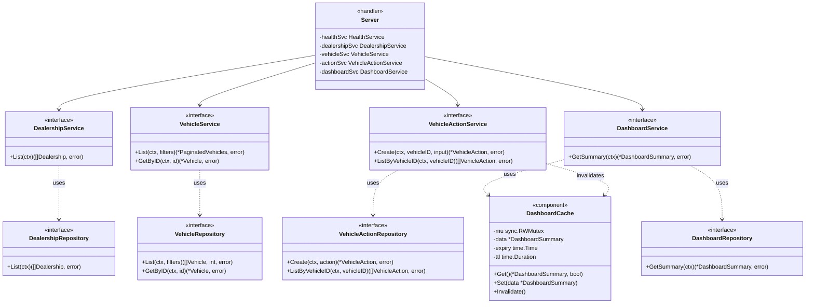
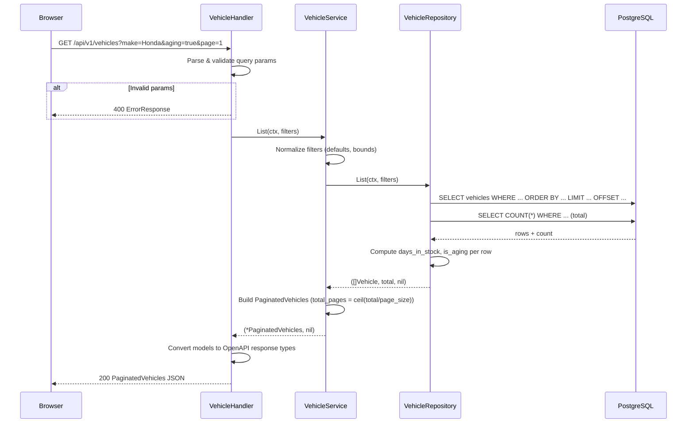
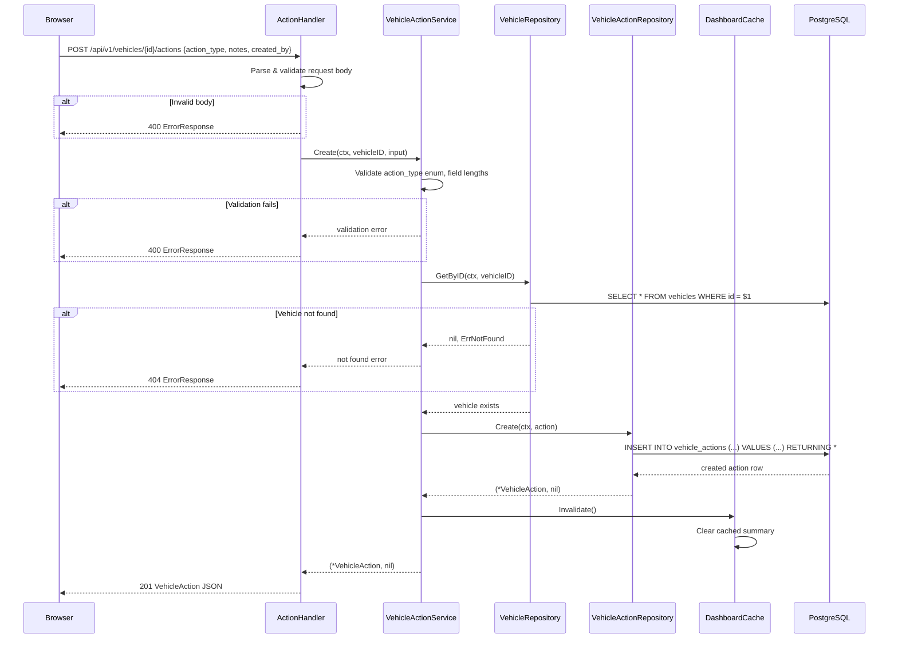
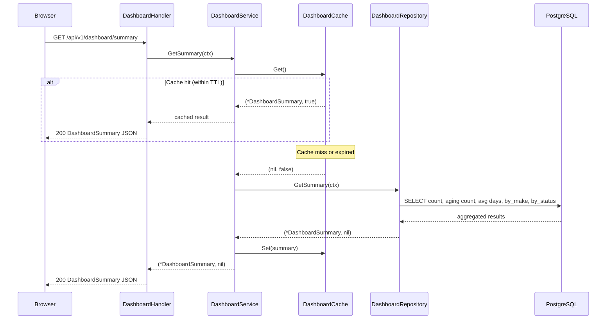

# Core Backend Implementation Specification

## Summary

Implement the three core backend features as vertical slices that bring the Intelligent Inventory Dashboard to life. The frontend is already fully built; this spec covers the backend service, repository, and handler layers needed to serve real data. Each feature cuts end-to-end through all backend layers.

**Feature 1: Inventory Visualization** — Vehicle listing with filtering, sorting, pagination, and dealership listing.
**Feature 2: Aging Stock Identification** — Dashboard summary with real-time aggregation, aging computation, and in-memory TTL caching.
**Feature 3: Actionable Insights** — Vehicle action creation and listing with validation, audit trail, and vehicle detail retrieval.

---

## User Stories

- As a dealership manager, I want to see a filterable list of all my vehicles so I can quickly find specific inventory.
- As a dealership manager, I want aging stock (>90 days) automatically highlighted so I can prioritize action on slow-moving inventory.
- As a dealership manager, I want a dashboard overview with aggregated stats so I can understand my inventory health at a glance.
- As a dealership manager, I want to log proposed actions on aging vehicles so my team can track what's being done about slow-moving stock.
- As a dealership manager, I want to view a vehicle's full action history so I can see the timeline of decisions made.

---

## Functional Requirements

### FR-1: List Dealerships

Returns all dealerships. Simple pass-through to the database.

**Acceptance criteria:**
- [ ] `GET /api/v1/dealerships` returns all dealerships as JSON array
- [ ] Each dealership includes id, name, location, created_at, updated_at
- [ ] 500 error returns ErrorResponse JSON on database failure

### FR-2: List Vehicles with Filters

Returns a paginated list of vehicles matching the given filters. Aging status (`days_in_stock`, `is_aging`) is computed at query time — never stored.

**Acceptance criteria:**
- [ ] `GET /api/v1/vehicles` returns PaginatedVehicles response
- [ ] Filter by `dealership_id` (UUID) — scopes results to one dealership
- [ ] Filter by `make` (case-insensitive partial match)
- [ ] Filter by `model` (case-insensitive partial match)
- [ ] Filter by `status` (exact match: available, sold, reserved)
- [ ] Filter by `aging=true` — only vehicles with `stocked_at` > 90 days ago
- [ ] Sort by `sort_by` (stocked_at, price, year, make) with `order` (asc, desc)
- [ ] Paginate with `page` (1-indexed, default 1) and `page_size` (default 20, max 100)
- [ ] Response includes `total`, `page`, `page_size`, `total_pages` metadata
- [ ] `days_in_stock` computed as `NOW() - stocked_at` in days
- [ ] `is_aging` computed as `days_in_stock > 90`
- [ ] Each vehicle includes its most recent action (if any) via a LEFT JOIN
- [ ] Invalid parameters return 400 ErrorResponse
- [ ] Default sort: `stocked_at DESC`

### FR-3: Get Vehicle Detail

Returns a single vehicle with its full action history.

**Acceptance criteria:**
- [ ] `GET /api/v1/vehicles/{id}` returns Vehicle with populated `actions` array
- [ ] Actions are ordered by `created_at DESC` (most recent first)
- [ ] `days_in_stock` and `is_aging` computed at query time
- [ ] Returns 404 ErrorResponse if vehicle not found
- [ ] UUID path parameter validated

### FR-4: List Vehicle Actions

Returns all actions for a specific vehicle.

**Acceptance criteria:**
- [ ] `GET /api/v1/vehicles/{id}/actions` returns array of VehicleAction
- [ ] Actions ordered by `created_at DESC`
- [ ] Returns 404 ErrorResponse if vehicle not found
- [ ] Returns empty array if vehicle exists but has no actions

### FR-5: Create Vehicle Action

Appends a new action to a vehicle's audit trail. Actions are immutable once created.

**Acceptance criteria:**
- [ ] `POST /api/v1/vehicles/{id}/actions` creates a new VehicleAction
- [ ] `action_type` must be one of: price_reduction, transfer, auction, marketing, wholesale, custom
- [ ] `created_by` is required, max 255 chars
- [ ] `notes` is optional, max 2000 chars
- [ ] Vehicle must exist (404 if not)
- [ ] Returns 201 with the created VehicleAction
- [ ] Returns 400 ErrorResponse for invalid input
- [ ] Action is append-only — no update or delete endpoints

### FR-6: Dashboard Summary

Returns aggregated inventory statistics. Results are cached in-memory with a 30-second TTL to balance freshness and performance.

**Acceptance criteria:**
- [ ] `GET /api/v1/dashboard/summary` returns DashboardSummary
- [ ] `total_vehicles` — count of all vehicles
- [ ] `aging_vehicles` — count where stocked_at > 90 days ago
- [ ] `average_days_in_stock` — average of `NOW() - stocked_at` across all vehicles
- [ ] `by_make[]` — count and aging_count grouped by make
- [ ] `by_status[]` — count grouped by status
- [ ] Results cached with 30s TTL (in-memory, thread-safe)
- [ ] Cache invalidated when new actions are created (write-through)
- [ ] 500 error returns ErrorResponse on failure

---

## Non-Functional Requirements

- **Performance**: All list queries must use parameterized SQL with proper indexes (already created). Dashboard query uses single SQL with aggregation. Cache reduces repeated DB hits.
- **Security**: All query parameters validated server-side. SQL injection prevented via pgx parameterized queries. Error messages sanitized — no stack traces or internal details exposed to clients.
- **Reliability**: Graceful error handling — database failures return 500 with generic message. Context propagation for request cancellation.
- **Observability**: All operations logged with `slog` including `request_id` from middleware. Error paths log full details server-side, return sanitized messages to client.

---

## Architecture Changes (C4)

### Diagrams to Update

1. **L3 Backend Component Diagram** in `docs/plans/2026-03-17-system-design.md` — Add the new service and repository implementations:
   - DealershipService + DealershipRepository
   - VehicleService + VehicleRepository
   - VehicleActionService + VehicleActionRepository
   - DashboardService + DashboardRepository + DashboardCache

2. **L2 Container Diagram** — No changes (same containers: frontend, backend, database)

### New Diagrams

**L4 Code Diagram** — Backend service layer relationships showing interface contracts and dependency injection:

---

## Runtime Flow Diagrams

### New Flow Diagrams

#### Flow 1: List Vehicles with Filters

**Key Invariants:**
- `days_in_stock` and `is_aging` always computed at query time, never stored
- `page_size` clamped to [1, 100]
- `page` minimum is 1
- Sort column is whitelisted (stocked_at, price, year, make) — no SQL injection via sort

**Error Paths:**
| Condition | Response | Rollback |
|-----------|----------|----------|
| Invalid UUID for dealership_id | 400 | None |
| Invalid status value | 400 | None |
| Database error | 500 | None (read-only) |

#### Flow 2: Create Vehicle Action

**Key Invariants:**
- Vehicle actions are append-only (INSERT only, no UPDATE/DELETE)
- Dashboard cache invalidated on every new action
- `action_type` must match the enum (price_reduction, transfer, auction, marketing, wholesale, custom)

**Error Paths:**
| Condition | Response | Rollback |
|-----------|----------|----------|
| Missing required fields | 400 | None |
| Invalid action_type | 400 | None |
| Vehicle not found | 404 | None |
| Database insert error | 500 | None (single INSERT) |

#### Flow 3: Dashboard Summary (Cached)

**Key Invariants:**
- Cache TTL is 30 seconds
- Cache is thread-safe (sync.RWMutex)
- Cache invalidated on action creation (not just TTL expiry)
- Aging threshold is always 90 days, computed via SQL `NOW() - stocked_at`

**Error Paths:**
| Condition | Response | Rollback |
|-----------|----------|----------|
| Database error | 500 | None (read-only) |
| Cache failure | Transparent fallback to DB | None |

---

## Data Model Changes

**No schema changes required.** The existing 3 tables (dealerships, vehicles, vehicle_actions) with their indexes are sufficient. All computed fields (days_in_stock, is_aging) are derived at query time.

**Existing indexes (already created):**
- `idx_vehicles_dealership_id` on vehicles(dealership_id)
- `idx_vehicles_make` on vehicles(make)
- `idx_vehicles_model` on vehicles(model)
- `idx_vehicles_stocked_at` on vehicles(stocked_at)
- `idx_vehicles_status` on vehicles(status)
- `idx_vehicle_actions_vehicle_id` on vehicle_actions(vehicle_id)

---

## API Changes

**No OpenAPI spec changes required.** All endpoints are already defined in `api/openapi.yaml`. The generated handler interfaces and TypeScript types are complete. This implementation only fills in the backend logic behind the existing stubs.

---

## UI/UX Changes

**No frontend changes required.** All pages, components, hooks, and error handling are already implemented:
- Dashboard page (`/`) — consumes `GET /api/v1/dashboard/summary`
- Inventory page (`/inventory`) — consumes `GET /api/v1/vehicles` with all filters
- Aging page (`/aging`) — consumes `GET /api/v1/vehicles?aging=true`
- Vehicle Detail page (`/vehicles/[id]`) — consumes `GET /api/v1/vehicles/{id}` and `POST /api/v1/vehicles/{id}/actions`

---

## Security & Risk Assessment

### Data Flow Diagram

| # | Source | Data | Trust Boundary Crossed? | Destination | Notes |
|---|--------|------|------------------------|-------------|-------|
| 1 | Manager (browser) | Filter params (make, model, status, aging, sort, page) | Yes: Internet → App | Vehicle Handler | Untrusted query params |
| 2 | Manager (browser) | Action form (action_type, notes, created_by) | Yes: Internet → App | Action Handler | Untrusted JSON body |
| 3 | Vehicle Handler | Parsed VehicleFilters | No (same tier) | VehicleService | Validated by handler |
| 4 | Action Handler | Parsed CreateActionInput | No (same tier) | VehicleActionService | Validated by service |
| 5 | VehicleService | SQL query with params | Yes: App → DB | PostgreSQL | pgx parameterized queries |
| 6 | VehicleActionService | INSERT with params | Yes: App → DB | PostgreSQL | pgx parameterized queries |
| 7 | DashboardService | Aggregation query | Yes: App → DB | PostgreSQL | pgx parameterized queries |
| 8 | PostgreSQL | Result rows | Yes: DB → App | Service layer | Trusted data from own DB |
| 9 | Service layer | JSON response | Yes: App → Internet | Browser | Sanitized response |

### Trust Boundaries

| Boundary | Crossed By | Security Control |
|----------|-----------|-----------------|
| Internet → Application | User HTTP requests (#1, #2) | Query param validation, JSON body validation, CORS middleware, X-Dealership-ID header |
| Application → Database | SQL queries (#5, #6, #7) | pgx parameterized queries (no string concatenation), dealership-scoped WHERE clauses |
| Database → Application | Result rows (#8) | Trusted — own database, no user-controlled data in schema |
| Application → Internet | JSON responses (#9) | No internal errors exposed, sanitized ErrorResponse format |

### Threats Identified (STRIDE per boundary crossing)

| # | Data Flow | Boundary | STRIDE | Threat | Severity | Mitigation |
|---|-----------|----------|--------|--------|----------|------------|
| T-1 | 1, 2 | Internet → App | Spoofing | Manager identity spoofed via X-Dealership-ID header | Medium | Validate dealership UUID exists in DB; future: JWT auth |
| T-2 | 1 | Internet → App | Tampering | Malicious filter values (SQL injection via sort_by) | High | Whitelist sort columns, pgx parameterized queries |
| T-3 | 2 | Internet → App | Tampering | Oversized notes field, invalid action_type | Medium | Server-side enum validation, max length checks |
| T-4 | 1, 2 | Internet → App | Repudiation | Manager denies creating an action | Low | Append-only actions with created_by + created_at timestamp |
| T-5 | 9 | App → Internet | Info Disclosure | Error messages leak DB schema or stack traces | Medium | Generic ErrorResponse format, no internal details |
| T-6 | 1 | Internet → App | DoS | Large page_size or rapid pagination requests | Medium | Max page_size=100 (enforced), rate limiting (future) |
| T-7 | 5 | App → DB | Info Disclosure | Query returns vehicles from other dealerships | High | Always scope queries with dealership_id WHERE clause when X-Dealership-ID is provided |
| T-8 | 6 | App → DB | Tampering | Action created for vehicle in different dealership | Medium | Validate vehicle belongs to requesting dealership |

### Authorization Rules

| Operation | Own Dealership | Other Dealership | No Dealership Header |
|-----------|---------------|-----------------|---------------------|
| List dealerships | Read all | Read all | Read all |
| List vehicles | Read own only | Denied (empty result) | Read all (no filter) |
| Get vehicle | Read own only | 404 | Read any |
| List actions | Read own vehicle's | 404 | Read any |
| Create action | Create on own vehicle | 404 | Create on any (no filter) |
| Dashboard summary | Global aggregation | N/A | Global aggregation |

**Note:** X-Dealership-ID is optional for now. When provided, it scopes vehicle queries. When absent, all vehicles are visible. This matches the current frontend which doesn't send dealership headers.

### Input Validation Rules

| Input | Layer | Validation | Server-side |
|-------|-------|-----------|-------------|
| dealership_id | Handler | Valid UUID format | Yes |
| make | Handler | String, max 100 chars | Yes |
| model | Handler | String, max 100 chars | Yes |
| status | Handler | Enum: available, sold, reserved | Yes |
| aging | Handler | Boolean | Yes |
| sort_by | Service | Enum: stocked_at, price, year, make | Yes (whitelist) |
| order | Service | Enum: asc, desc | Yes |
| page | Service | Integer >= 1, default 1 | Yes |
| page_size | Service | Integer 1-100, default 20 | Yes |
| action_type | Service | Enum: price_reduction, transfer, auction, marketing, wholesale, custom | Yes |
| notes | Service | String, max 2000 chars | Yes |
| created_by | Service | Required, max 255 chars | Yes |
| vehicle ID (path) | Handler | Valid UUID format | Yes (oapi-codegen) |

### External Dependency Risks

No new external dependencies are introduced. All implementations use existing packages:
- `pgx/v5` — PostgreSQL driver (already in go.mod)
- `google/uuid` — UUID handling (already in go.mod)
- Standard library `sync`, `time` — for caching

### Sensitive Data Handling

| Data | Sensitivity | Protection |
|------|------------|-----------|
| Vehicle VIN | Internal | Not exposed in list view (only detail), no search by VIN in backend |
| Vehicle price | Internal | Read-only from DB, no mutation endpoints |
| created_by (action) | Internal | Required field, stored as-is, no PII processing |
| Dealership data | Internal | Scoped by dealership_id when header provided |

### Issues & Risks Summary

1. **X-Dealership-ID header is easily spoofable** — Acceptable for MVP, mitigated by future JWT auth. Currently no sensitive PII at risk.
2. **No rate limiting** — Could allow rapid requests to dashboard/list endpoints. Mitigated by page_size cap and cache TTL. Add rate limiting in future.
3. **Dashboard cache is per-process** — In multi-instance deployment, each instance has its own cache. Acceptable for single-instance MVP. Future: Redis or shared cache.
4. **Sort column injection** — Mitigated by whitelisting allowed sort columns in service layer. Never interpolate sort_by directly into SQL.

---

## Edge Cases & Error Handling

| Scenario | Expected Behavior |
|----------|-------------------|
| Empty inventory (no vehicles) | Return PaginatedVehicles with empty items[], total=0 |
| All vehicles aging | Dashboard aging_vehicles equals total_vehicles |
| Vehicle with no actions | GetVehicle returns empty actions array |
| Page beyond total | Return empty items[] with correct total_pages |
| Concurrent action creation | Each INSERT is atomic; cache invalidation is thread-safe |
| Database connection lost mid-request | Context cancellation, 500 response, log error |
| Null price in database | Vehicle.Price is *float64 (nullable), serialized as null in JSON |
| Very long notes (exactly 2000 chars) | Accepted (boundary value) |
| Notes at 2001 chars | Rejected with 400 |

---

## Dependencies & Assumptions

- **Database schema is ready** — All 3 tables with indexes exist (migrations already applied)
- **Seed data exists** — 2 dealerships, 16 vehicles, 10 actions for testing
- **Frontend is complete** — No frontend changes needed
- **OpenAPI spec is final** — No changes to api/openapi.yaml
- **Generated code is current** — api.gen.go and types.ts are up to date
- **Single instance deployment** — In-memory cache is sufficient (no Redis needed)

---

## Out of Scope

- JWT authentication / user management
- Vehicle CRUD (create, update, delete vehicles)
- Rate limiting middleware
- Redis or distributed caching
- WebSocket real-time updates
- Export/import functionality
- Batch operations
- Multi-instance cache synchronization
- Dealership CRUD (create, update, delete dealerships)

---

## Feature Split Summary

| Feature | Endpoints | Backend Files | Priority |
|---------|-----------|--------------|----------|
| **F1: Inventory Visualization** | ListDealerships, ListVehicles | Dealership repo+svc, Vehicle repo+svc, Handler wiring | 1st (foundation) |
| **F2: Aging Stock + Dashboard** | GetDashboardSummary | Dashboard repo+svc, DashboardCache, Handler wiring | 2nd (depends on F1 repo) |
| **F3: Actionable Insights** | GetVehicle, ListVehicleActions, CreateVehicleAction | VehicleAction repo+svc, Handler wiring, cache invalidation | 3rd (depends on F1+F2) |

This ordering ensures each feature builds on the previous one's repository layer, and the dashboard cache invalidation in F3 depends on F2's cache component.
