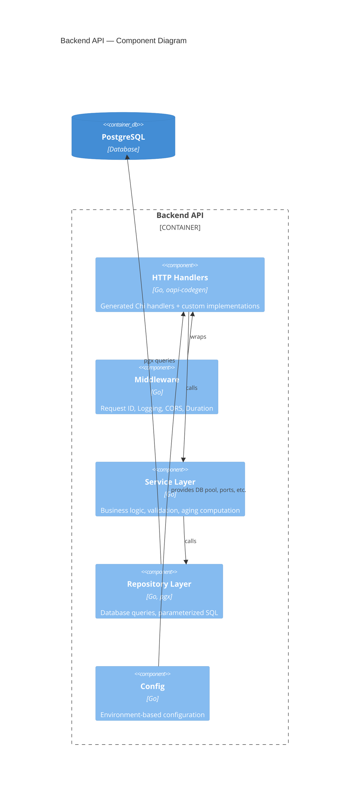
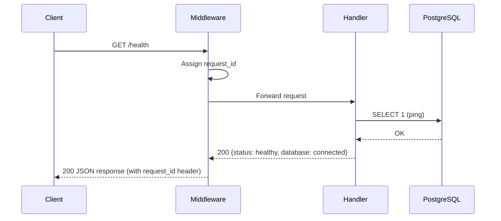

# Project Initialization — Source Code Structure Specification

## Summary

Initialize the full working project structure for the Intelligent Inventory Dashboard monorepo. This creates the OpenAPI spec (single source of truth), Go backend skeleton with Chi + oapi-codegen, Next.js 14 frontend with shadcn/ui, PostgreSQL migrations with seed data, Docker Compose orchestration, and Makefile for common commands. After completion, `docker compose up` starts the full stack with a working health endpoint, and the code generation pipeline (`make generate`) produces Go and TypeScript types from the OpenAPI spec.

## User Stories

- As a developer, I want to run `docker compose up` and have the full stack running, so that I can start building features immediately.
- As a developer, I want to edit `api/openapi.yaml` and run `make generate` to update both Go and TypeScript types, so that the API contract stays in sync.
- As a developer, I want the database schema pre-created with seed data, so that I can develop against realistic data.
- As a developer, I want `go test ./...` and `npm test` to work from day one, so that I have a foundation for TDD.

## Functional Requirements

### FR-1: OpenAPI Specification
Define all 7 API endpoints in `api/openapi.yaml` per the system design document.

**Acceptance criteria:**
- [ ] OpenAPI 3.0 spec with all endpoints from Section 4 of system design
- [ ] Request/response schemas for all endpoints
- [ ] Query parameter definitions for vehicle list endpoint
- [ ] Proper UUID format for IDs
- [ ] Enum constraints for status and action_type fields

### FR-2: Go Backend Skeleton
Initialize Go module with Chi router, oapi-codegen generated handlers, and layered architecture.

**Acceptance criteria:**
- [ ] `backend/go.mod` with correct module path and dependencies
- [ ] `backend/cmd/server/main.go` — entry point that starts HTTP server on port 8080
- [ ] `backend/internal/handler/` — oapi-codegen generated interface + stub implementation
- [ ] `backend/internal/service/` — service layer interfaces (empty implementations OK)
- [ ] `backend/internal/repository/` — repository layer interfaces (empty implementations OK)
- [ ] `backend/internal/middleware/` — request ID, logging, CORS middleware
- [ ] `backend/internal/config/` — environment-based configuration
- [ ] Health endpoint returns `{"status":"healthy"}` with database connectivity check
- [ ] `go build ./...` succeeds
- [ ] `go test ./...` runs (at least one test exists)

### FR-3: Next.js Frontend Skeleton
Initialize Next.js 14 project with App Router, shadcn/ui, TanStack Query, and Tailwind CSS.

**Acceptance criteria:**
- [ ] `frontend/package.json` with Next.js 14, React 18, TanStack Query v5, Tailwind CSS
- [ ] shadcn/ui initialized with base components
- [ ] App Router structure with 4 placeholder pages: `/`, `/inventory`, `/aging`, `/vehicles/[id]`
- [ ] Generated TypeScript types from OpenAPI spec in `frontend/src/lib/api/types.ts`
- [ ] Basic layout with navigation between pages
- [ ] `npm run dev` starts dev server on port 3000
- [ ] `npm run build` succeeds
- [ ] `npm test` runs (at least one test exists)

### FR-4: Database Migrations
Create PostgreSQL schema and seed data using golang-migrate.

**Acceptance criteria:**
- [ ] `backend/migrations/001_init.up.sql` — creates dealerships, vehicles, vehicle_actions tables with indexes
- [ ] `backend/migrations/001_init.down.sql` — drops all tables
- [ ] `backend/migrations/002_seed.up.sql` — inserts sample data (2 dealerships, ~20 vehicles including aging ones, ~10 actions)
- [ ] `backend/migrations/002_seed.down.sql` — deletes seed data
- [ ] Migrations run successfully on `docker compose up`

### FR-5: Docker Compose
Full stack orchestration with PostgreSQL, backend, and frontend.

**Acceptance criteria:**
- [ ] `docker-compose.yaml` with 3 services: `db`, `api`, `web`
- [ ] `backend/Dockerfile` — multi-stage build for Go binary
- [ ] `frontend/Dockerfile` — multi-stage build for Next.js
- [ ] PostgreSQL 16 with health check
- [ ] Backend depends on healthy database
- [ ] Frontend depends on backend
- [ ] `.env.example` with all required environment variables
- [ ] `docker compose up` starts everything successfully

### FR-6: Makefile
Common development commands.

**Acceptance criteria:**
- [ ] `make generate` — runs both Go and TypeScript code generation
- [ ] `make generate-go` — runs oapi-codegen on openapi.yaml
- [ ] `make generate-ts` — runs openapi-typescript on openapi.yaml
- [ ] `make migrate-up` — applies pending migrations
- [ ] `make migrate-down` — rolls back last migration
- [ ] `make test` — runs all backend and frontend tests
- [ ] `make dev` — starts local development (optional, Docker Compose may suffice)

### FR-7: Code Generation Pipeline
Verify the full OpenAPI → Go types + TypeScript types pipeline works.

**Acceptance criteria:**
- [ ] `oapi-codegen` generates `backend/internal/handler/api.gen.go` from `api/openapi.yaml`
- [ ] `openapi-typescript` generates `frontend/src/lib/api/types.ts` from `api/openapi.yaml`
- [ ] Generated files are NOT committed (added to `.gitignore`) — OR — generated files are committed for CI convenience (decide)
- [ ] `make generate && cd backend && go build ./...` succeeds
- [ ] `make generate && cd frontend && npm run build` succeeds

## Non-Functional Requirements

- **Performance:** Backend should start in <5 seconds locally. Health endpoint responds in <50ms.
- **Security:** No hardcoded secrets. All configuration via environment variables. Database connection uses parameterized queries only.
- **Maintainability:** Code follows Go and TypeScript idioms. Clear separation of layers. Generated code is clearly marked "DO NOT EDIT."

## Architecture Changes (C4)

### Diagrams to Update
- No changes to existing C4 Container diagram in `docs/plans/2026-03-17-system-design.md` — this init matches the existing design exactly.

### New Diagrams
- **L3 Backend Component Diagram** — Add to system design doc showing handler/service/repository/middleware layers and their dependencies.

## Runtime Flow Diagrams

### New Flow Diagrams
- **Health Check Flow** — Simple flow to document the initial working endpoint. Add to system design doc.

## Data Model Changes

No changes — implementing the schema exactly as defined in system design Section 3.2:
- `dealerships` table
- `vehicles` table (with `stocked_at` for aging computation)
- `vehicle_actions` table (append-only)
- All indexes from Section 3.2

## API Changes

Full OpenAPI 3.0 spec created from scratch per system design Section 4:

| Method | Endpoint | Description |
|--------|----------|-------------|
| GET | `/health` | Health check with DB ping |
| GET | `/api/v1/dealerships` | List all dealerships |
| GET | `/api/v1/vehicles` | List vehicles (filterable, paginated) |
| GET | `/api/v1/vehicles/{id}` | Get single vehicle details |
| POST | `/api/v1/vehicles/{id}/actions` | Log an action for a vehicle |
| GET | `/api/v1/vehicles/{id}/actions` | List actions for a vehicle |
| GET | `/api/v1/dashboard/summary` | Aggregated inventory stats |

## UI/UX Changes

Minimal for this init — just placeholder pages with navigation.

### Existing Component Inventory (REQUIRED)

| Need | Existing Component | Location |
|------|--------------------|----------|
| Navigation/layout shell | NEW — create basic layout | `frontend/src/app/layout.tsx` |
| Placeholder page content | NEW — simple heading + description | Each page route |

### New Components (if any)

| Component | Location | Justification |
|-----------|----------|---------------|
| Root layout with nav | `frontend/src/app/layout.tsx` | Required by Next.js App Router |
| Navigation component | `frontend/src/components/nav.tsx` | Links between 4 pages |

**Note:** shadcn/ui will be initialized but full component usage starts in feature implementation, not init.

## Security & Risk Assessment

### Data Flow Diagram

| # | Source | Data | Trust Boundary Crossed? | Destination | Notes |
|---|--------|------|------------------------|-------------|-------|
| 1 | Browser | HTTP request | Yes: Internet → App | Go Handler | Untrusted input |
| 2 | Go Handler | Parsed request | No (same process) | Service Layer | Validated by oapi-codegen |
| 3 | Service Layer | Query params | Yes: App → DB | PostgreSQL | pgx parameterized |
| 4 | PostgreSQL | Query result | Yes: DB → App | Service Layer | Trusted data store |
| 5 | Service Layer | Domain model | No (same process) | Handler | JSON serialized |
| 6 | Handler | HTTP response | Yes: App → Internet | Browser | Sanitized response |

### Trust Boundaries

| Boundary | Crossed By | Security Control |
|----------|-----------|-----------------|
| Internet → Application | User HTTP requests | CORS middleware, oapi-codegen request validation |
| Application → Database | SQL queries | pgx parameterized queries, connection pool limits |
| Database → Application | Query results | Type-safe pgx scanning |
| Application → Internet | HTTP responses | JSON serialization, no internal error details |

### Threats Identified (STRIDE per boundary crossing)

| # | Data Flow | Boundary | STRIDE | Threat | Severity | Mitigation |
|---|-----------|----------|--------|--------|----------|------------|
| T-1 | 1 | Internet → App | Spoofing | No auth in v1, anyone can call endpoints | Low (init only) | Auth is out of scope per system design; add in future |
| T-2 | 1 | Internet → App | Tampering | Malformed requests | Medium | oapi-codegen validates request shape; server-side validation in service layer |
| T-3 | 1 | Internet → App | DoS | Flood requests | Low | Not addressed in init; add rate limiting in future |
| T-4 | 1 | Internet → App | Info Disclosure | Stack traces in error responses | Medium | Custom error handler that never exposes internals |
| T-5 | 3 | App → DB | Tampering | SQL injection | High | pgx parameterized queries exclusively — never string concatenation |
| T-6 | 3 | App → DB | Info Disclosure | Cross-dealership data access | Medium | All queries scoped by dealership_id (enforced in service layer) |
| T-7 | 6 | App → Internet | Info Disclosure | Sensitive data in responses | Low | Only return necessary fields, no internal IDs or config |

### Authorization Rules

No authentication/authorization in v1 (per system design scope). All endpoints are publicly accessible. This is acceptable for the initial scaffold — auth will be added as a dedicated feature.

### Input Validation Rules

| Input | Where | Validation |
|-------|-------|------------|
| Path params (UUID) | oapi-codegen | UUID format validation |
| Query params | oapi-codegen + service | Type checking, enum validation, range limits |
| Request body | oapi-codegen + service | Required fields, string lengths, enum values |
| Page/page_size | Service layer | Positive integers, max page_size=100 |

### External Dependency Risks

| Package | Language | Trust Level | Risk | Mitigation |
|---------|----------|-------------|------|------------|
| chi v5 | Go | High (widely used) | Low | Pinned version in go.mod |
| oapi-codegen | Go | High | Low | Pinned version; generated code is reviewed |
| pgx v5 | Go | High | Low | Pinned version |
| golang-migrate v4 | Go | High | Low | Pinned version |
| Next.js 14 | JS | High | Low | Pinned version in package.json |
| TanStack Query v5 | JS | High | Low | Pinned version |
| shadcn/ui | JS | High (Radix-based) | Low | Copied into project, not a runtime dep |
| openapi-typescript | JS | Medium | Low | Dev dependency only, pinned version |

### Sensitive Data Handling

| Data | Sensitivity | Protection |
|------|------------|------------|
| Database credentials | Restricted | Environment variables only, never in code |
| Vehicle VINs | Internal | No special protection needed (public data) |
| Vehicle prices | Internal | Standard access controls |
| Dealership info | Internal | Standard access controls |

### Issues & Risks Summary

1. **No authentication** — All endpoints are public in v1. Acceptable for init but must be addressed before production.
2. **No rate limiting** — Endpoints could be overwhelmed. Low risk for development.
3. **Generated code review** — oapi-codegen output should be spot-checked on first generation.
4. **Seed data** — Contains realistic but fake data. Must not contain real VINs or dealership info.

## Edge Cases & Error Handling

- **Database not ready on startup:** Backend retries DB connection with exponential backoff.
- **Port conflicts:** Docker Compose uses specific ports (5432, 8080, 3000). Document port mapping.
- **Code generation failures:** Makefile targets should fail fast with clear error messages.
- **Missing environment variables:** Backend validates required env vars at startup and fails with clear message.

## Dependencies & Assumptions

- Docker and Docker Compose v2 installed locally
- Go 1.22+ installed for local development
- Node.js 18+ installed for local development
- `oapi-codegen` CLI installed (or installed via `go install`)
- `openapi-typescript` installed as dev dependency in frontend

## Out of Scope

- Authentication / authorization (future feature)
- Rate limiting (future feature)
- Full business logic implementation (future features — this is skeleton only)
- Production deployment configuration
- CI/CD pipeline
- OpenTelemetry / Prometheus / Grafana (future)
- WebSocket / SSE real-time updates (future)
